# RECTOR: Rule-Enforced Constrained Trajectory Orchestrator

> **Authors**: Hadi Hajieghrary, Benedikt Walter, Chaitanya Shinde, Miguel Hurtado — TORC Robotics; and Paul Schmitt — MassRobotics

---

## What This Repository Is

This repository is a full research workspace for rule-aware trajectory forecasting and evaluation. It includes not only the learned RECTOR model, but also the data-engineering stack, the 28-rule evaluation framework, predictor-agnostic selection on top of pretrained M2I trajectories, a Waymax-based closed-loop simulator, artifact-generation scripts, and paper-writing assets.

In practical terms, the workspace supports the full lifecycle of the project:

1. **Acquire and organize WOMD data**
2. **Filter and convert scenarios into model-friendly formats**
3. **Augment scenarios with explicit rule labels**
4. **Train and evaluate RECTOR**
5. **Run predictor-agnostic selection with M2I+RECTOR**
6. **Measure closed-loop behavior in Waymax**
7. **Generate figures, tables, logs, and videos for reporting**
8. **Assemble manuscript and presentation material**

This README is intended to be the master document for that workspace. The sections below describe the scientific method in detail, but they also map the top-level directory structure, development environment, outputs, and validation paths so the file reflects the whole codebase rather than only the core model.

## Papers

- [Camera-ready paper (PDF)](IEEE_T-IV_2026_camera_ready/Main.pdf)
- [Extended paper (PDF)](IEEE_T-IV_2026_ext/Main.pdf)

<p align="center">
  
</p>
<p align="center"><em>Repository-level presentation overview exported from the project slide deck. This GIF summarizes the main problem setting, pipeline components, evaluation framing, and artifact outputs represented throughout this workspace.</em></p>

## Workspace At A Glance

The repository is organized into several major layers:

| Path | Role | Representative contents |
|------|------|-------------------------|
| [data/](data/) | Dataset provenance, processing, augmentation, and visualization | WOMD datasets, conversion scripts, rule augmentation, BEV movies |
| [models/](models/) | Learned models, pretrained assets, experiments, and publication artifacts | RECTOR implementation, checkpoints, pretrained M2I, generated figures |
| [scripts/](scripts/) | Workspace-level utilities and closed-loop evaluation | simulation engine, analysis tools, dataset management scripts |
| [output/](output/) | Generated evidence from training, evaluation, and simulation | canonical JSONs, per-scenario CSVs, logs, rollout videos |
| [assets/](assets/) | Curated media used in documentation | GIFs and extracted frames embedded in README and docs |
| [externals/](externals/) | Third-party source dependencies | M2I and Waymo Open Dataset source trees |
| [reference/](reference/) | Paper-writing and presentation workspace | IEEE T-IV LaTeX sources, figures, slides, reviews |
| [src/](src/) | Native utilities | C++ scenario conversion helper(s) |
| [notebooks/](notebooks/) | Exploratory analysis space | notebook-based experiments and inspection |
| [experiments/](experiments/) | Additional experiment staging area | scratch or reserved experiment workspace |

Key workspace-level documentation:

| Document | Purpose |
|----------|---------|
| [WORKSPACE_STRUCTURE.md](WORKSPACE_STRUCTURE.md) | Maintained repository snapshot for quick navigation |
| [data/README.md](data/README.md) | Data pipeline and augmentation overview |
| [models/README.md](models/README.md) | Model inventory across the workspace |
| [scripts/README.md](scripts/README.md) | Workspace-level scripts and automation |
| [output/README.md](output/README.md) | Generated outputs and provenance |
| [.devcontainer/README.md](.devcontainer/README.md) | Reproducible development environment |
| [externals/README.md](externals/README.md) | External dependency layout and path assumptions |

## Source Files and Derived Artifacts

The repository intentionally keeps both source-authored content and reproducible derived artifacts in version control.

- Source-authored content includes model code, data-processing logic, simulation code, hand-maintained documentation, and the LaTeX manuscript source.
- Derived artifacts include evaluation JSONs, per-scenario CSVs, rollout videos, figure exports, presentation media, and maintained inventory snapshots such as [WORKSPACE_STRUCTURE.md](WORKSPACE_STRUCTURE.md) and [data/DATA_INVENTORY.md](data/DATA_INVENTORY.md).
- When a file is produced or refreshed by a script, the relevant script is documented nearby so that provenance stays explicit without turning the user-facing docs into build logs.

## End-to-End Repository Workflow

The codebase is designed around an end-to-end workflow rather than a single entry script.

```text
WOMD raw scenarios
  -> interactive-scene filtering and format conversion
  -> 28-rule augmentation
  -> RECTOR training and canonical evaluation
  -> M2I+RECTOR predictor-agnostic selection
  -> Waymax closed-loop simulation
  -> figure, table, and video generation
  -> manuscript and presentation assets
```

Directory-wise, this typically maps to:

```text
data/WOMD/
  -> models/RECTOR/scripts/
  -> output/evaluation/
  -> scripts/simulation_engine/
  -> output/closedloop/
  -> models/RECTOR/output/artifacts/
  -> IEEE_T-IV_2026_ext
```

## Recommended Reading Order

If you need to understand the codebase efficiently, read in this order:

1. This root README for the workspace-level narrative.
2. [data/README.md](data/README.md) for data provenance and augmentation.
3. [data/WOMD/waymo_rule_eval/README.md](data/WOMD/waymo_rule_eval/README.md) for the 28-rule system.
4. [models/RECTOR/README.md](models/RECTOR/README.md) for the two main research tracks.
5. [models/RECTOR/scripts/README.md](models/RECTOR/scripts/README.md) for executable research workflows.
6. [scripts/simulation_engine/README.md](scripts/simulation_engine/README.md) for closed-loop evaluation.
7. [output/README.md](output/README.md) to connect scripts to generated evidence.

## Development Environment and Dependencies

The repository is intended to run inside the configured development container described in [.devcontainer/README.md](.devcontainer/README.md). That environment provides:

- Ubuntu 22.04
- CUDA 12.1 and cuDNN 8
- Python 3.10 in `/opt/venv`
- PyTorch, TensorFlow, Waymo tooling, ffmpeg, and TeX Live
- VS Code extensions for Python, Jupyter, Docker, GitLens, and LaTeX

The workspace also expects two external repositories under [externals/](externals/):

| External repository | Purpose |
|---------------------|---------|
| [externals/M2I](externals/M2I) | DenseTNT/M2I backbone and utilities |
| [externals/waymo-open-dataset](externals/waymo-open-dataset) | Waymo proto definitions and data tooling |

Many scripts assume the standard workspace paths described in the devcontainer and externals docs. The most important environment roots are:

- `WAYMO_DATA_ROOT=/workspace/data/WOMD/datasets/waymo_open_dataset/motion_v_1_3_0`
- `WAYMO_RAW_ROOT=/workspace/data/WOMD/datasets/waymo_open_dataset/motion_v_1_3_0/raw`
- `WAYMO_PROCESSED_ROOT=/workspace/data/WOMD/datasets/waymo_open_dataset/motion_v_1_3_0/processed`
- `WAYMO_MOVIES_ROOT=/workspace/data/WOMD/movies`

## Motivation

Multi-modal trajectory prediction has largely converged on a standard formulation: condition on scene context, sample K candidate futures, and rank them with a learned confidence score. This pipeline optimizes geometric accuracy by minimizing displacement error against the ground-truth trajectory, and it does that part well. State-of-the-art models routinely achieve sub-meter average displacement errors on benchmark datasets.

The problem is that geometric accuracy is necessary but not sufficient for deployment. A trajectory that minimizes ADE but runs a red light is less useful than one with slightly higher error that obeys the signal. A lane change that achieves the lowest FDE but cuts off a cyclist at 0.3 m clearance is not a viable plan. Confidence-based ranking cannot distinguish between those outcomes because the confidence head is trained to predict geometric likelihood, not behavioral compliance. It selects the most *probable* trajectory, not the most *permissible* one.

Weighted-sum approaches try to address this by combining geometric cost and rule penalties into a single scalar. That introduces a fundamental limitation: for any finite weight assignment, there exists some small enough comfort gain that can offset a safety violation. The safety guarantee collapses into a tuning problem, and the tuning problem has no principled solution because the tiers are not directly commensurate.

RECTOR replaces scalar scoring with **lexicographic ordering**: a strict priority structure where Safety violations are resolved before Legal violations are considered, Legal before Road, and Road before Comfort. This is not a weight assignment; it is a structural guarantee. By construction, no finite comfort improvement can override a safety violation.

---

## Data Pipeline: Waymo Open Motion Dataset

RECTOR trains on the Waymo Open Motion Dataset (WOMD) v1.3.0. The raw dataset provides 91-timestep driving scenarios at 10 Hz (9.1 seconds each), containing ego and agent trajectories, lane geometry, road edges, crosswalks, stop signs, and traffic signal states. The data pipeline transforms these raw protobuf records into training-ready TFRecords augmented with 28-rule supervision labels.

### Processing Stages

```
Raw WOMD TFRecords (Scenario proto, ~151 GB)
    │
    ├─ filter_interactive_scenario.py
    │   Filter to 2-agent interactive scenarios (v2v, v2p, v2c)
    │   Output: training_interactive, validation_interactive, testing_interactive
    │
    ├─ scenario_to_example.py
    │   Convert Scenario proto → TF Example format
    │   Fixed feature layout: max_agents=128, num_map_samples=20,000
    │
    └─ augment_cli.py (waymo_rule_eval framework)
        Evaluate 28 rules per scenario, write augmented TFRecords
        Output: 4 new feature vectors per scenario (see below)
```

### Rule Evaluation Framework

The rule evaluation framework in [`data/WOMD/waymo_rule_eval/`](data/WOMD/waymo_rule_eval/) applies the same two-phase pattern to each of the 28 rules:

**Phase 1 — Applicability Detection**: determines whether a rule is relevant to the scenario. For example, a crosswalk-yield rule is inapplicable on a highway, and a traffic-signal rule is inapplicable at an uncontrolled intersection. Each detector returns a binary `applies` flag, a confidence score, and human-readable reasons.

**Phase 2 — Violation Evaluation** (only if applicable): measures violation severity on a continuous scale. It returns a normalized severity in [0, 1], frame-level violation indices, and supporting measurements such as minimum clearance in meters or deceleration in m/s^2.

The framework builds on four core data structures defined in [`core/context.py`](data/WOMD/waymo_rule_eval/core/context.py):

| Structure | Fields | Purpose |
|-----------|--------|---------|
| `EgoState` | x, y, yaw, speed, length, width, valid — all shape (T,) | Ego vehicle trajectory and dimensions |
| `Agent` | id, type, x, y, yaw, speed, length, width, valid | Other traffic participants (vehicle, pedestrian, cyclist) |
| `MapContext` | lane_center_xy, crosswalk_polys, road_edges, stop_signs, speed_limit | Static map features |
| `MapSignals` | signal_state per timestep (8 states: unknown through flashing_caution) | Dynamic traffic signal states |
| `ScenarioContext` | ego + agents + map + signals, dt=0.1, n_frames=91 | Complete scenario container |

The `MotionScenarioReader` adapter in [`data_access/adapter_motion_scenario.py`](data/WOMD/waymo_rule_eval/data_access/adapter_motion_scenario.py) converts Waymo protobufs into `ScenarioContext`, handling validity masks, zero-dimension defaults, and type-specific sizes (vehicle: 4.5x1.8 m, pedestrian: 0.5x0.5 m, cyclist: 1.8x0.6 m). The `RuleExecutor` in [`pipeline/rule_executor.py`](data/WOMD/waymo_rule_eval/pipeline/rule_executor.py) then evaluates all 28 registered rules and collects the outputs into a `ScenarioResult`.

### Augmented TFRecord Format

Each augmented scenario carries four 28-element feature vectors aligned to the canonical rule ordering defined in [`rules/rule_constants.py`](data/WOMD/waymo_rule_eval/rules/rule_constants.py):

```
rule/applicability:  int64[28]    # 1 = rule applies, 0 = not applicable
rule/violations:     int64[28]    # 1 = violation occurred, 0 = compliant
rule/severity:       float32[28]  # Continuous severity [0, 1+]
rule/ids:            bytes[28]    # Canonical rule ID labels (L0.R2, L0.R3, ...)
```

The `RULE_IDS` list is sorted alphabetically for index stability. All downstream code — model heads, proxies, loss functions, evaluation scripts — references `RULE_INDEX_MAP` to ensure consistent alignment.

### Geometric Operations

The framework includes SAT (Separating Axis Theorem) collision detection in [`core/geometry.py`](data/WOMD/waymo_rule_eval/core/geometry.py) for oriented bounding box overlap, and O(log N) temporal-spatial indexing in [`core/temporal_spatial.py`](data/WOMD/waymo_rule_eval/core/temporal_spatial.py) for efficient agent proximity queries. These same primitives are reused in the safety layer for closed-loop simulation.

### Dataset Visualization

120 bird's-eye-view scenario videos across 3 splits x 2 formats: [`data/WOMD/movies/bev/`](data/WOMD/movies/bev/). 90 static PNG renderings with overview, multi-frame, and combined views: [`data/WOMD/visualizations/`](data/WOMD/visualizations/).

---

## Method

### Lexicographic Selection

Given K = 6 candidate trajectories from a CVAE decoder, RECTOR scores each candidate against 28 traffic rules organized into four tiers, then selects by strict priority:

```
1. Among all candidates, retain those with minimum Safety-tier cost (within epsilon)
2. Among survivors, retain those with minimum Legal-tier cost
3. Among survivors, retain those with minimum Road-tier cost
4. Among survivors, select the candidate with minimum Comfort-tier cost
5. Break ties by prediction confidence
```

This tier-by-tier elimination is the central mechanism. It is implemented as a batched GPU operation with O(K x T) complexity, where K is the number of candidates and T is the number of tiers, and it adds negligible latency at inference time.

<p align="center">
  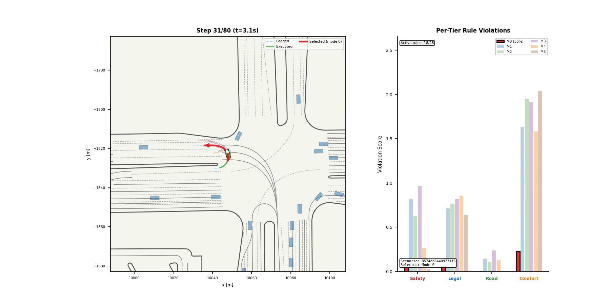
</p>
<p align="center"><em>Closed-loop intersection turn (scenario 000, step 31/80). Left: BEV with real WOMD road geometry, 24 agents (blue), 11 crosswalks, 9 stop signs. Logged trajectory (green dashed), executed RECTOR trajectory (green solid), selected mode (red). Right: per-tier rule violation scores for all 6 candidate modes — the selector picks the mode with lowest Safety-tier cost.</em></p>

<p align="center">
  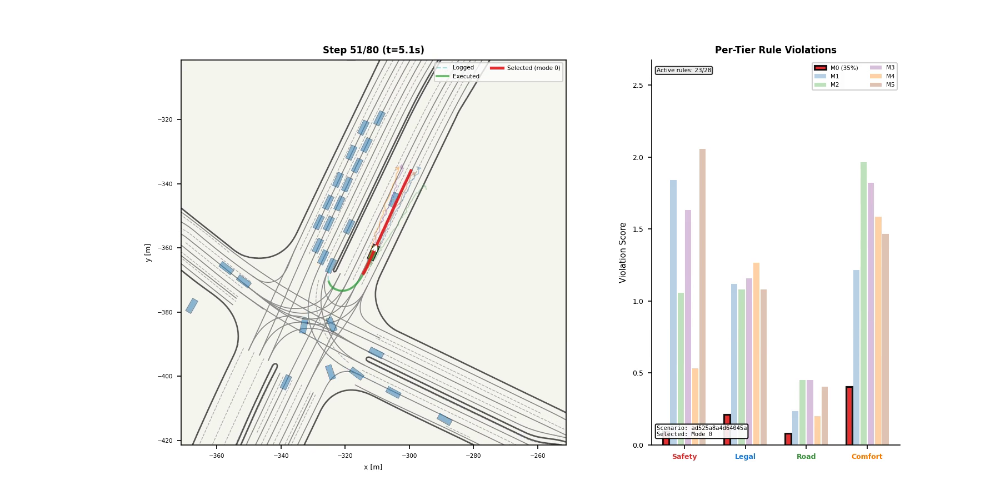
</p>
<p align="center"><em>Closed-loop intersection (scenario 010, step 51/80). A dense scene with 185 agents, 4 crosswalks, 2 stop signs. The violation panel shows differentiated Safety, Legal, and Comfort costs across modes. The selector avoids modes with elevated Safety-tier costs even when they have higher confidence.</em></p>

<p align="center">
  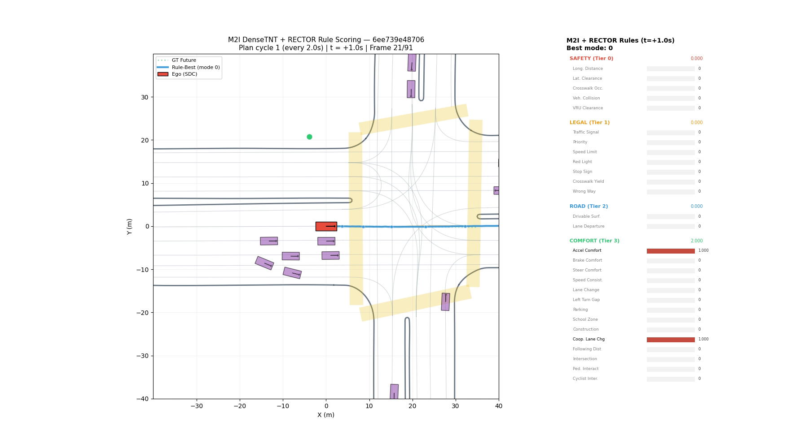
</p>
<p align="center"><em>M2I+RECTOR predictor-agnostic selection (scenario 6ee739e48706, frame 21/91). Left: ego vehicle (red rectangle) at a crosswalk-heavy intersection with multiple agents (purple rectangles). GT future (dashed), rule-best mode (blue solid). Right: full 28-rule breakdown — Safety, Legal, and Road tiers show zero cost; Comfort tier shows non-zero Accel Comfort and Cooperative Lane Change costs, which differentiate the candidate modes.</em></p>

### Rule Hierarchy

The 28 rules span 9 hierarchical levels (L0, L1, L3-L8, L10) drawn from traffic law and driving best practices. They are grouped into four tiers with exponentially decreasing priority weights (1000x, 100x, 10x, 1x):

| Tier | Priority | Rules | Coverage | Examples |
|------|----------|-------|----------|----------|
| **Safety** | 1000x | 5 | 5/5 proxied | Collision (L10.R1), VRU clearance (L10.R2), longitudinal/lateral distance (L0.R2-R3), crosswalk occupancy (L0.R4) |
| **Legal** | 100x | 7 | 6/7 proxied | Traffic signal (L5.R1), red light (L8.R1), stop sign (L8.R2), speed limit (L7.R4), wrong-way (L8.R5), crosswalk yield (L8.R3) |
| **Road** | 10x | 2 | 2/2 proxied | Drivable surface (L3.R3), lane departure (L7.R3) |
| **Comfort** | 1x | 14 | 11/14 proxied | Smooth accel/braking/steering (L1.R1-R3), speed consistency (L1.R4), following distance (L6.R2), interaction rules (L6.R1, L6.R3-R5) |

24 of 28 rules have differentiable proxies — smooth, continuous approximations that enable gradient-based training while preserving the rank-ordering of candidates (Spearman rho = 0.91 against discrete evaluators). The 4 without proxies (L5.R2-R5: priority violation, parking, school zone, construction zone) require discrete zone data unavailable in WOMD and are evaluated only in the full 28-rule post-hoc analysis.

The complete 28-rule catalog with mathematical formulations:

| Index | Rule ID | Level | Name | Tier | Proxy |
|-------|---------|-------|------|------|-------|
| 0 | L0.R2 | 0 | Safe Longitudinal Distance | Safety | CollisionProxy (min_distance=2.0m) |
| 1 | L0.R3 | 0 | Safe Lateral Clearance | Safety | CollisionProxy (min_distance=0.5m) |
| 2 | L0.R4 | 0 | Crosswalk Occupancy | Safety | CollisionProxy |
| 3 | L1.R1 | 1 | Smooth Acceleration | Comfort | SmoothnessProxy |
| 4 | L1.R2 | 1 | Smooth Braking | Comfort | SmoothnessProxy |
| 5 | L1.R3 | 1 | Smooth Steering | Comfort | SmoothnessProxy |
| 6 | L1.R4 | 1 | Speed Consistency | Comfort | SmoothnessProxy |
| 7 | L1.R5 | 1 | Lane Change Smoothness | Comfort | SmoothnessProxy |
| 8 | L3.R3 | 3 | Drivable Surface | Road | LaneProxy (stay-on-road) |
| 9 | L4.R3 | 4 | Left Turn Gap | Comfort | InteractionProxy |
| 10 | L5.R1 | 5 | Traffic Signal Compliance | Legal | SignalProxy |
| 11 | L5.R2 | 5 | Priority Violation | Legal | *none* |
| 12 | L5.R3 | 5 | Parking Violation | Comfort | *none* |
| 13 | L5.R4 | 5 | School Zone Compliance | Comfort | *none* |
| 14 | L5.R5 | 5 | Construction Zone Compliance | Comfort | *none* |
| 15 | L6.R1 | 6 | Cooperative Lane Change | Comfort | InteractionProxy |
| 16 | L6.R2 | 6 | Following Distance | Comfort | CollisionProxy |
| 17 | L6.R3 | 6 | Intersection Negotiation | Comfort | InteractionProxy |
| 18 | L6.R4 | 6 | Pedestrian Interaction | Safety | CollisionProxy (VRU margin=1.0m) |
| 19 | L6.R5 | 6 | Cyclist Interaction | Safety | CollisionProxy (VRU margin=1.0m) |
| 20 | L7.R3 | 7 | Lane Departure | Road | LaneProxy (max_lateral=1.8m) |
| 21 | L7.R4 | 7 | Speed Limit | Legal | SpeedLimitProxy |
| 22 | L8.R1 | 8 | Red Light | Legal | SignalProxy |
| 23 | L8.R2 | 8 | Stop Sign | Legal | SignalProxy |
| 24 | L8.R3 | 8 | Crosswalk Yield | Legal | SignalProxy |
| 25 | L8.R5 | 8 | Wrong-Way | Legal | LaneProxy (angle_threshold=135 deg) |
| 26 | L10.R1 | 10 | Collision | Safety | CollisionProxy |
| 27 | L10.R2 | 10 | VRU Clearance | Safety | CollisionProxy (VRU) |

Proxy implementations: [`models/RECTOR/scripts/proxies/`](models/RECTOR/scripts/proxies/). All proxies use an exponential cost function: `cost = 1 - exp(-softness * violation)`, which returns 0 for compliant trajectories, approaches 1 for severe violations, and has high gradient near the threshold — enabling effective gradient-based optimization.

### Architecture

RECTOR is a 9.02M-parameter model composed of four components. The tiered scorer and rule proxies contribute zero learnable parameters — they encode domain knowledge as fixed computation.

<p align="center">
  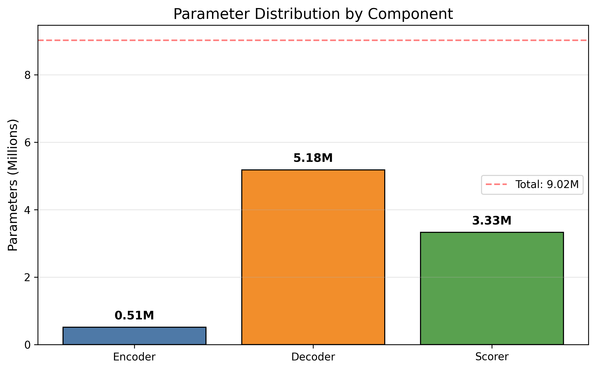
</p>
<p align="center"><em>Parameter distribution: Encoder 0.51M, Decoder 5.18M, Applicability Head 3.33M. Total: 9.02M. The figure labels the applicability head as "Scorer" — the tiered scorer itself has zero learnable parameters (fixed computation). The decoder (CVAE Transformer) dominates, consistent with its role as the primary generative component.</em></p>

#### M2I Scene Encoder (~0.51M trainable params)

A polyline-based encoder derived from the M2I (DenseTNT) backbone. It processes three input streams:

- **Ego history**: [B, 11, 4] — 1.1 seconds of (x, y, heading, speed) at 10 Hz
- **Agent states**: [B, 32, 11, 4] — nearest 32 agents, same history window
- **Lane centers**: [B, 64, 20, 2] — 64 nearest lane polylines, 20 points each

The encoding pipeline: SubGraph polyline encoding (3-layer MLP with max-pooling over vectors) produces per-element features, then GlobalGraph multi-head self-attention captures interactions across all elements (ego + agents + lanes). Optional LaneGCN cross-attention (A2L, L2L, L2A) refines agent-lane relationships. Output: a 256-dimensional scene embedding and per-element feature vectors [B, 1+A+L, 256].

All spatial coordinates are transformed to ego-centric frame (ego at origin, heading aligned to +x) and normalized by TRAJECTORY_SCALE = 50.0.

Pre-trained on the M2I objective, the encoder fine-tunes at 0.1x the base learning rate to prevent catastrophic forgetting.

#### CVAE Trajectory Head (~5.18M params)

A 6-mode Conditional Variational Autoencoder with a Transformer decoder:

- **GoalPredictionHead**: K=6 learnable goal queries attend to the scene embedding via cross-attention, producing [B, 6, 2] goal positions and [B, 6] confidence scores. Goals anchor trajectory endpoints.
- **TrajectoryEncoder** (posterior, training only): encodes the ground-truth trajectory via Conv1d layers (4→64→128, kernel=5) + adaptive pooling, producing posterior mean and log-variance for the latent code z (dim=64).
- **Prior network**: predicts z from scene embedding alone (used at inference).
- **TransformerTrajectoryDecoder**: 4-layer, 8-head Transformer decoder with 50 learnable trajectory queries (one per timestep), sinusoidal positional encoding, and FF dimension = 4x hidden. Conditioned on (scene_embedding, z, goal), it produces [B, 50, 4] per mode — 5 seconds of (dx, dy, heading, speed) at 10 Hz.
- **Output scale**: learnable per-dimension scales initialized to [0.15, 0.15, 0.04, 0.10], controlling per-timestep diversity.

All 50 timesteps are generated in parallel (no autoregressive error accumulation).

#### Rule Applicability Head (~3.33M params)

Four TierAwareBlocks — one per tier — each containing:

1. **Learnable rule queries**: [num_rules_in_tier, 256], initialized with randn x 0.02
2. **Intra-tier self-attention**: MultiheadAttention(256, 4 heads) captures inter-rule dependencies (e.g., collision implies clearance violation)
3. **Scene cross-attention**: MultiheadAttention queries attend to per-element scene features
4. **FFN**: [256 → 384 → 256] with ReLU
5. **Classifier**: [256 → 192 → 1] with output bias = -1.0 (most rules are not applicable)

A final refinement MLP with gated residual [28 → hidden → 28] combines cross-tier signals.

Output: [B, 28] applicability logits, sigmoid-activated to probabilities.

#### Tiered Lexicographic Scorer (0 learnable params)

Implements tier-by-tier elimination. During training, a `SoftLexicographicLoss` provides gradient flow via softmin with per-tier temperatures [0.01, 0.1, 1.0, 10.0] — Safety tier receives near-hard selection while Comfort tier allows soft exploration. During inference, exact lexicographic comparison with epsilon=0.01 tolerance is used.

Architecture details and tensor shapes: [`models/RECTOR/scripts/models/README.md`](models/RECTOR/scripts/models/README.md).

### Differentiable Rule Proxies

The proxy aggregator `DifferentiableRuleProxies` maps trajectories [B, M, H, 2+] to violation costs [B, M, 28]. Five proxy classes cover 24 of 28 rules:

| Proxy | Rules | Method |
|-------|-------|--------|
| **CollisionProxy** | L0.R2, L0.R3, L0.R4, L6.R2, L6.R4, L6.R5, L10.R1, L10.R2 | OBB distance with exponential cost. VRU rules add 1.0m margin for pedestrians/cyclists. |
| **LaneProxy** | L3.R3, L7.R3, L8.R5 | Project trajectory to nearest lane polyline. L3.R3: off-road distance. L7.R3: lateral offset > 1.8m. L8.R5: heading error > 135 deg. |
| **SpeedLimitProxy** | L7.R4 | Compare trajectory speed to lane-associated speed limits. Soft threshold. |
| **SignalProxy** | L5.R1, L8.R1, L8.R2, L8.R3 | Traffic light state compliance. Red light and stop sign penalties. |
| **SmoothnessProxy** | L1.R1-R5 | Jerk (3rd derivative), lateral acceleration, steering rate penalties. |
| **InteractionProxy** | L4.R3, L6.R1, L6.R3 | Dangerous acceleration patterns near other agents. |

Proxy implementations: [`models/RECTOR/scripts/proxies/README.md`](models/RECTOR/scripts/proxies/README.md).

### Two-Stage Training

Training proceeds in two stages to address severe class imbalance in rule applicability labels (some rules are applicable in fewer than 2% of scenarios).

**Stage 1 — Applicability Pre-training** (20 epochs, ~3.65M params, ~2.5 hours): The M2I encoder is frozen. Only the applicability head trains, using focal BCE loss (gamma=2.0) with per-rule positive-class weighting (neg/pos ratio clamped to [1.0, 20.0]) and a 3x multiplier for safety-tier rules. OneCycleLR scheduler, peak LR = 3e-4. Batch size = 128.

**Stage 2 — End-to-End Fine-tuning** (20 epochs + 3 continuation epochs, all 9.02M params, ~11 hours): The pretrained applicability head is loaded from Stage 1. The entire model trains jointly, with the M2I encoder at 0.1x learning rate. OneCycleLR scheduler, peak LR = 3e-4 (initial) then 5e-5 (continuation). Batch size = 64 (effective 256 with gradient accumulation of 4). Data: 500 training TFRecord files, 150 validation files.

A 7-component composite loss drives optimization:

| Component | Weight | Purpose |
|-----------|--------|---------|
| WTA Reconstruction | 20.0 | Huber loss (beta=0.5) on best-mode trajectory. Temporal weighting [1.0→2.0], dimension weighting [2.0, 2.0, 0.5, 0.5] for (x, y, yaw, speed). |
| Endpoint / FDE | 5.0 | Extra loss on final position accuracy |
| KL Divergence | 0.05 | CVAE latent space regularization (clamped logvar [-10, 2]) |
| Goal Prediction | 2.0 | Goal head endpoint accuracy (Huber loss) |
| Smoothness | 1.0 | Jerk penalty on best mode |
| Confidence | 1.0 | Mode confidence calibration (KL to oracle one-hot) |
| Applicability BCE | 1.0 | 28-rule applicability classification |

<p align="center">
  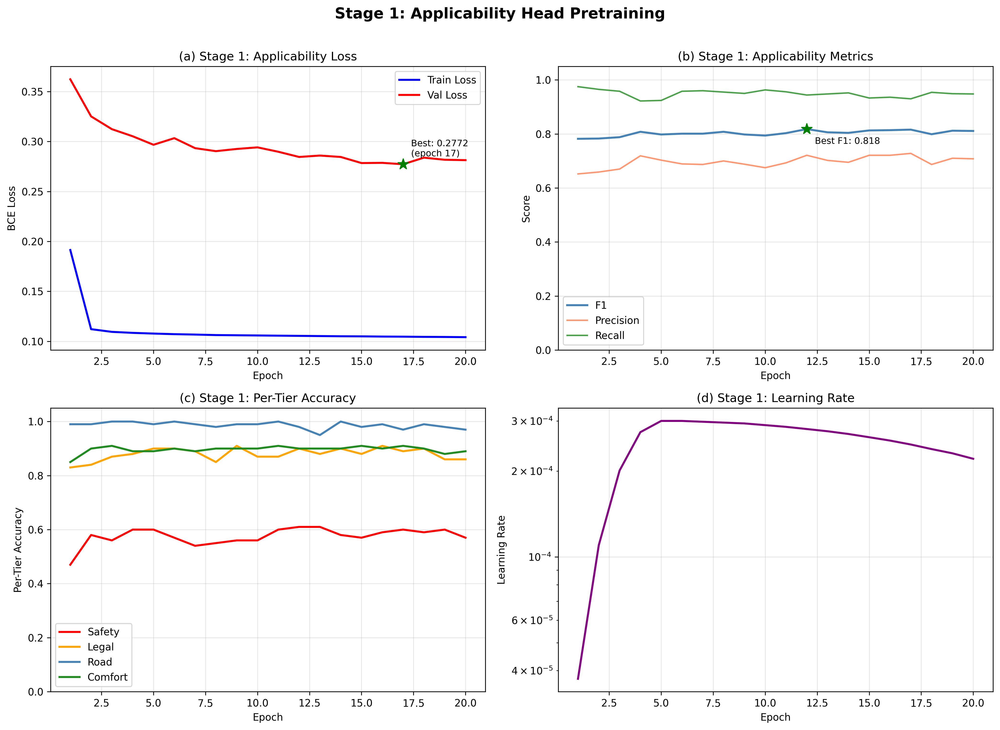
</p>
<p align="center"><em>Stage 1: Applicability head converges to best validation loss 0.2772 (epoch 17) with F1=0.818, precision=0.708, recall=0.948. Per-tier accuracy panel (c) shows Legal and Road tiers stabilize near 1.0 while Safety stabilizes near 0.6 — reflecting the higher difficulty of safety-rule applicability detection due to class imbalance.</em></p>

<p align="center">
  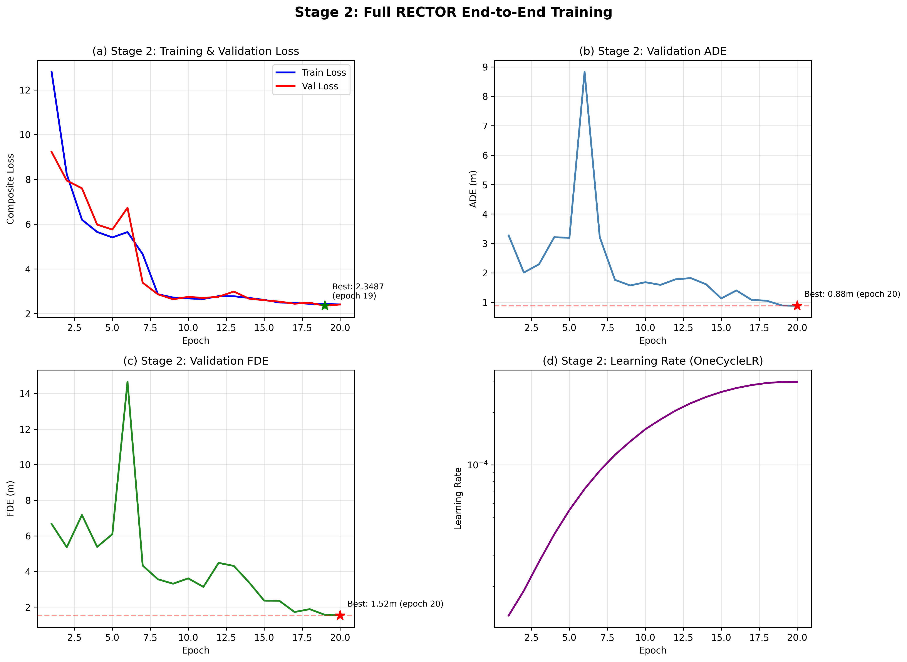
</p>
<p align="center"><em>Stage 2: Full model converges to best validation loss 2.3487 (epoch 19). Validation ADE drops from 3.27m to 0.88m; FDE from 6.67m to 1.52m. The spike at epoch 6 reflects a transient instability during OneCycleLR warmup, self-corrected by epoch 8. Continuation training (3 additional epochs at LR=5e-5) reduces ADE to 0.67m.</em></p>

<p align="center">
  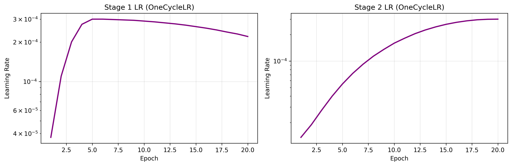
</p>
<p align="center"><em>Learning rate schedules for both stages. Stage 1: OneCycleLR peaks at 3e-4. Stage 2: OneCycleLR peaks at 1.5e-4 (the encoder receives 0.1x of these values).</em></p>

Training pipeline details: [`models/RECTOR/scripts/training/README.md`](models/RECTOR/scripts/training/README.md).

### Inference Pipeline

The inference pipeline ([`scripts/inference/pipeline.py`](models/RECTOR/scripts/inference/pipeline.py)) executes five stages:

1. **Scene encoding**: ego history + agent states + lane geometry → 256-d scene embedding
2. **Applicability prediction**: scene embedding → [28] rule applicability mask
3. **Candidate generation**: scene embedding → K=6 trajectory samples [K, 50, 4] + confidence [K]
4. **Proxy evaluation**: trajectories + scene features → violation costs [K, 28]
5. **Lexicographic selection**: tier-by-tier elimination → selected trajectory index

Total inference latency: **7.3 ms** (scene encoding 2.1ms, trajectory generation 3.8ms, rule evaluation 1.4ms). Throughput: ~98 samples/second.

<p align="center">
  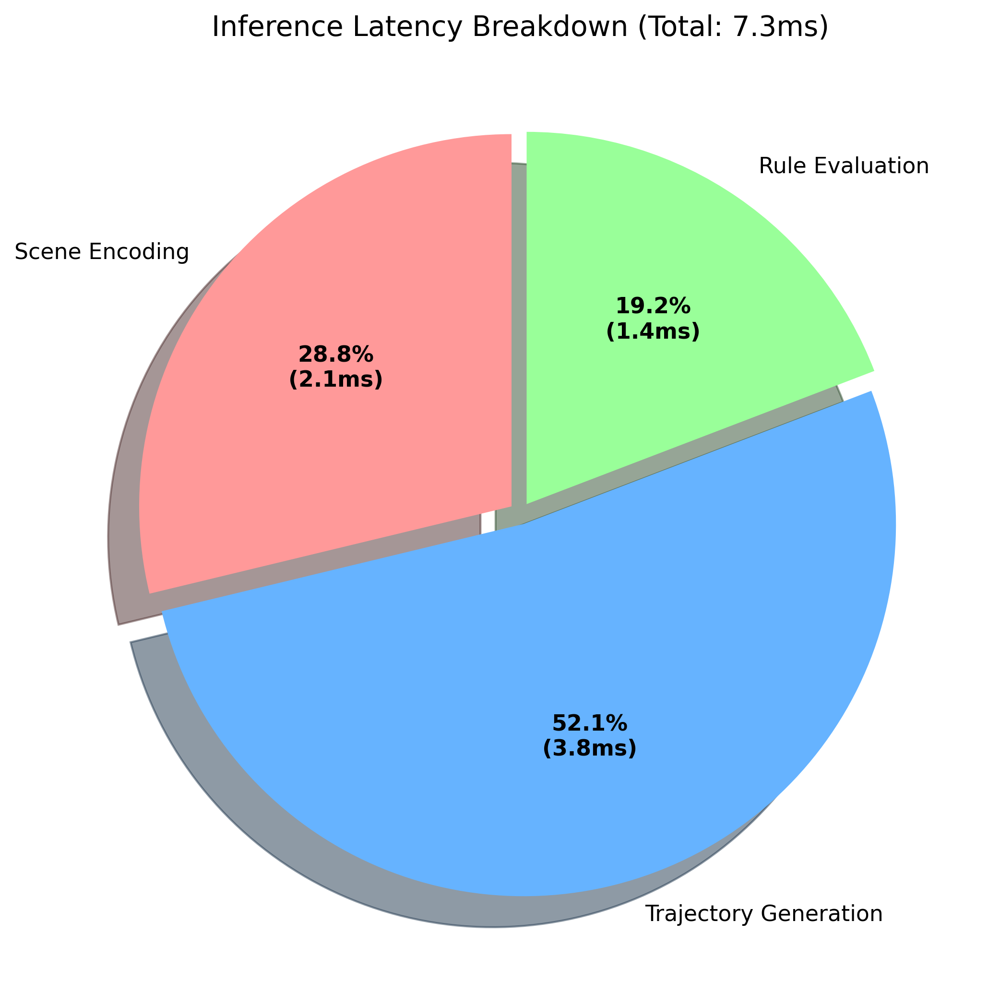
</p>
<p align="center"><em>Latency breakdown: trajectory generation dominates at 52.1% (3.8ms). Rule evaluation adds 19.2% (1.4ms) — the cost of compliance awareness.</em></p>

<p align="center">
  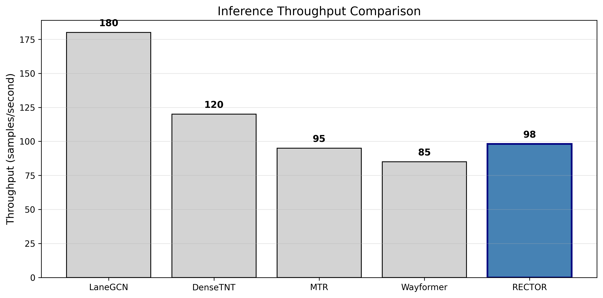
</p>
<p align="center"><em>Inference throughput: RECTOR (98 samples/s) is competitive with MTR (95) and Wayformer (85), and moderately below DenseTNT (120) and LaneGCN (180). The rule evaluation overhead is offset by the smaller encoder.</em></p>

---

## Results

All numbers below are drawn from [`canonical_results.json`](output/evaluation/canonical_results.json), the canonical evaluation output produced by [`evaluate_canonical.py`](models/RECTOR/scripts/evaluation/evaluate_canonical.py) over the full 12,800-scenario WOMD `validation_interactive` split. Checkpoint hash: `c90d4457e4996d22`.

### Geometric Accuracy

Oracle (best-of-6) trajectory metrics establish that the underlying predictor is competitive:

| Metric | Value |
|--------|-------|
| Oracle minADE | 0.684 m (std: 0.754) |
| Oracle minFDE | 1.270 m (std: 1.815) |
| Miss Rate (FDE > 2.0 m) | 18.56% |
| Validation samples | 12,800 scenarios (150 shards) |

The error distribution is right-skewed but concentrated at low values. The median ADE is 0.46 m and median FDE is 0.69 m — the majority of predictions are accurate and the mean is pulled by a tail of difficult scenarios.

<p align="center">
  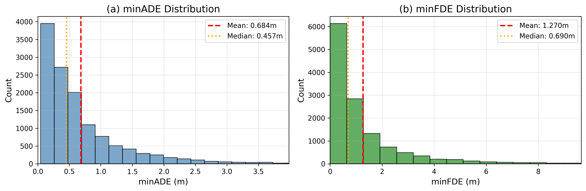
</p>
<p align="center"><em>Histograms of oracle minADE and minFDE with mean/median lines. The right skew is visible: most predictions cluster below 1m, but a tail extends beyond 3m.</em></p>

<p align="center">
  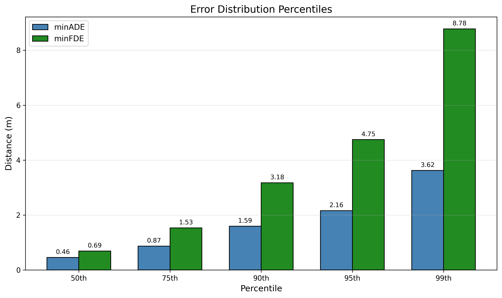
</p>
<p align="center"><em>Error percentiles. P50: ADE=0.46m, FDE=0.69m. P90: ADE=1.59m, FDE=3.18m. P99: ADE=3.62m, FDE=8.78m. The 99th percentile tail drives the mean upward from the median.</em></p>

<p align="center">
  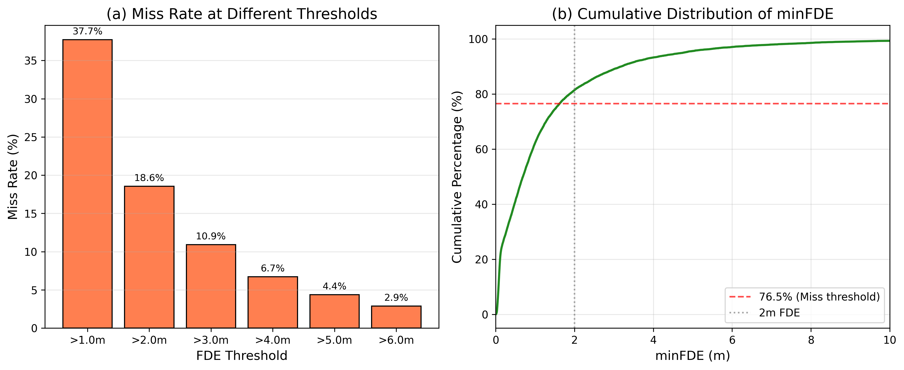
</p>
<p align="center"><em>(a) Miss rate at FDE thresholds from 1m to 6m. The standard 2m threshold yields 18.6%; at 4m, miss rate drops to 6.7%. (b) Cumulative FDE distribution: 76.5% of scenarios have best-mode FDE below 2m.</em></p>

<p align="center">
  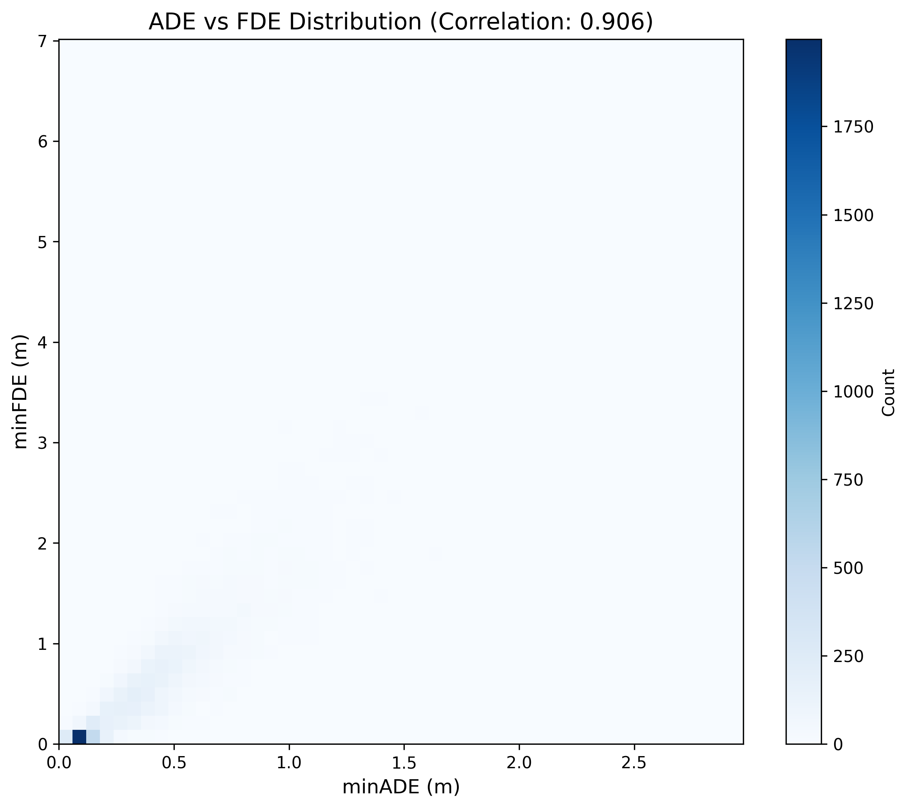
</p>
<p align="center"><em>Joint ADE-FDE density (Pearson r = 0.906). The strong correlation confirms that trajectory-level accuracy is consistent between average and final displacement. The high-density cluster at the origin contains scenarios where the best mode closely tracks ground truth.</em></p>

### Selection Strategy Comparison

The central claim: rule-aware selection reduces violations without catastrophic loss of geometric accuracy. Three strategies are compared under identical conditions — same model, same candidates, same scenarios:

| Strategy | selADE (m) | selFDE (m) | Total Violations | Safety+Legal | Comfort |
|----------|-----------|-----------|-----------------|-------------|---------|
| Confidence-only | 2.208 | 4.330 | 23.86% | 21.87% | 2.90% |
| Weighted Sum | 2.043 | 3.813 | 15.03% | 13.15% | 2.07% |
| **Lexicographic** | **2.043** | **3.813** | **15.03%** | **13.15%** | **2.07%** |

Lexicographic selection reduces total violations by **37.0%** relative to confidence-only (from 23.86% to 15.03%) and Safety+Legal violations by **39.9%** (from 21.87% to 13.15%). The geometric cost is modest: selected ADE increases from the oracle 0.684 m to 2.043 m, reflecting the expected tradeoff when the selector overrides the most-confident mode in favor of a compliant one.

The reduction concentrates in the Safety tier, where it matters most:

<p align="center">
  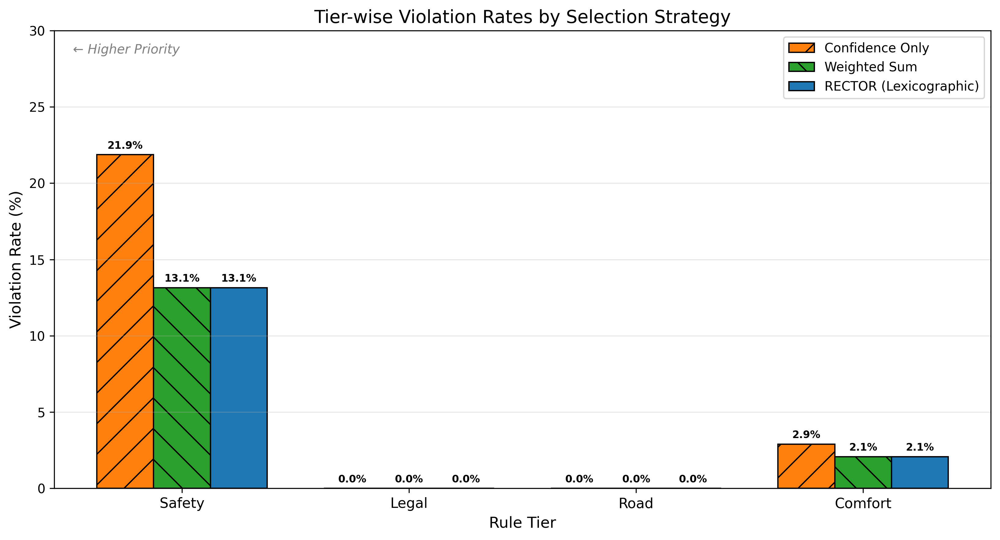
</p>
<p align="center"><em>Safety-tier violations drop from 21.9% (confidence) to 13.1% (RECTOR). Legal and Road tiers show 0% violations across all strategies under the proxy-24 rule set. Comfort violations decrease modestly from 2.9% to 2.1%.</em></p>

<p align="center">
  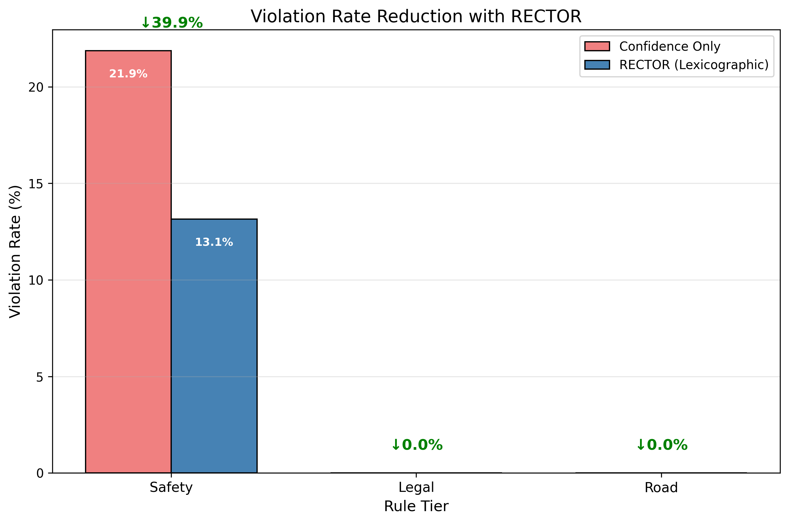
</p>
<p align="center"><em>Stacked violation reduction: 39.9% total reduction concentrated in the Safety tier (21.9% → 13.1%). Legal/Road remain at 0%. Comfort shows marginal reduction (2.9% → 2.1%).</em></p>

**Why lexicographic and weighted-sum converge here:** With the current proxy-24 rule set, 0% Legal and Road violations, and learned applicability masking, the two selectors converge to identical selections in nearly all scenarios. The distinction becomes critical (a) under adversarial injection, where an injected collision-course trajectory can fool weighted-sum if the weight ratio is insufficient, and (b) with the full 28-rule set, where non-zero Legal/Road violations create tier conflicts that only lexicographic ordering resolves correctly.

### Protocol Comparison

The canonical evaluation supports a 2x2 protocol matrix — rule set (proxy-24 vs full-28) crossed with applicability source (oracle vs predicted):

| Protocol | Total Violations | Safety | Legal | Road | Comfort |
|----------|-----------------|--------|-------|------|---------|
| proxy-24, predicted | 15.03% | 13.15% | 0.0% | 0.0% | 2.07% |
| proxy-24, oracle | 32.11% | 19.94% | 0.88% | 1.52% | 11.97% |
| full-28, predicted | 15.03% | 13.15% | 0.0% | 0.0% | 2.07% |
| full-28, oracle | 32.11% | 19.94% | 0.88% | 1.52% | 11.97% |

Predicted applicability (15.03%) outperforms oracle (32.11%) on violation metrics. This occurs because the learned head defaults to predicting most rules as applicable (high recall: 0.948), which adds more constraints and suppresses violations. Oracle applicability correctly masks inapplicable rules, removing constraints and allowing violations in scenarios where specific rules genuinely do not apply. This reveals that over-prediction of applicability acts as implicit regularization.

### Applicability Head Performance

The applicability head predicts which rules are relevant in each scene. Per-rule F1 scores vary substantially:

<p align="center">
  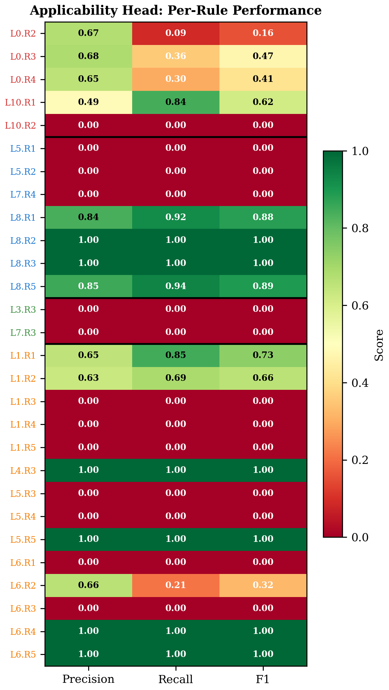
</p>
<p align="center"><em>Per-rule precision, recall, and F1. Six rules achieve F1 near 1.0 (L4.R3, L5.R5, L6.R4, L6.R5, L8.R2, L8.R3) — these are rules applicable in >99% of scenarios. Rules with sparse positive labels show lower F1 (L0.R2: 0.16, L6.R2: 0.32). Twelve rules have F1=0.0 because they have zero positive samples in the validation set.</em></p>

<p align="center">
  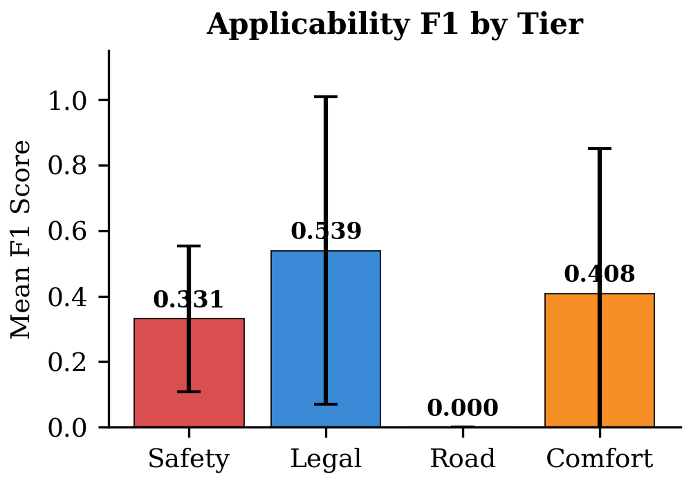
</p>
<p align="center"><em>Mean F1 by tier: Safety 0.331, Legal 0.539, Road 0.000, Comfort 0.408. The high variance (error bars) reflects the mix of always-applicable rules (F1~1.0) and rare rules (F1~0.0) within each tier. Road tier has F1=0.0 because both road rules (L3.R3, L7.R3) have near-zero positive rates.</em></p>

<p align="center">
  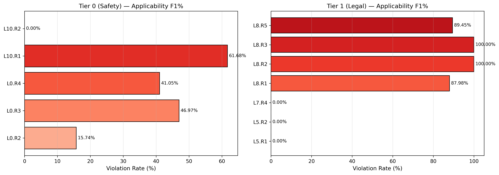
</p>
<p align="center"><em>Per-rule F1 by tier. Safety tier: L10.R1 (collision) achieves 61.7% F1 — the strongest signal for the most critical rule. Legal tier: L8.R5 (wrong-way), L8.R3 (crosswalk yield), L8.R2 (stop sign) all exceed 89% F1.</em></p>

### Ablation Study

Component ablation confirms that each architectural choice contributes:

<p align="center">
  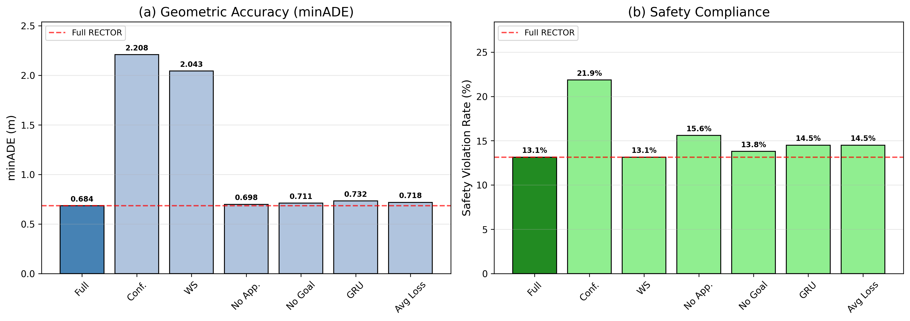
</p>
<p align="center"><em>(a) Oracle minADE is stable across ablation variants (~0.68-0.73m), confirming that selection strategy primarily affects compliance, not geometric accuracy. (b) Safety violation rates: confidence-only (21.9%) vs. full RECTOR (13.1%). Removing the applicability head increases violations to 15.6%.</em></p>

<p align="center">
  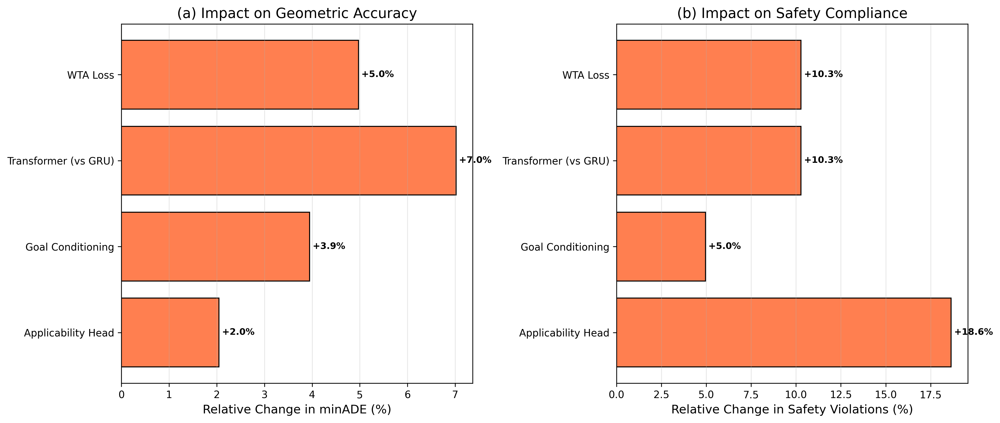
</p>
<p align="center"><em>(a) Impact on geometric accuracy: Transformer vs GRU decoder contributes +7.0% relative ADE improvement; WTA loss +5.0%; goal conditioning +3.9%; applicability head +2.0%. (b) Impact on safety compliance: applicability head contributes the largest safety improvement (+18.6% relative reduction), followed by Transformer (+10.3%) and WTA loss (+10.3%).</em></p>

<p align="center">
  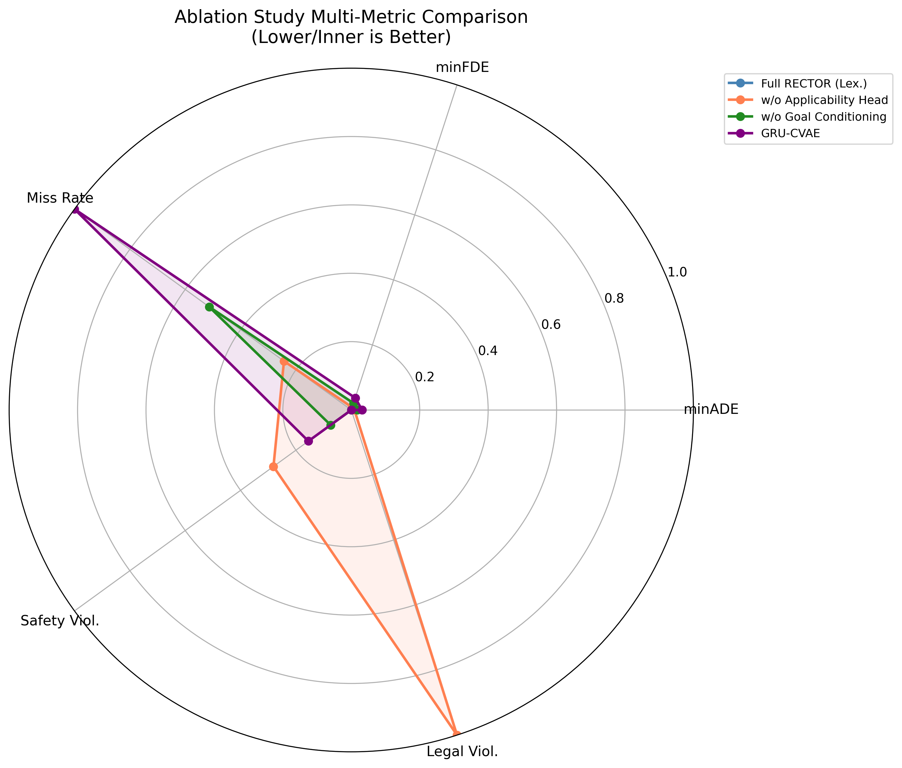
</p>
<p align="center"><em>Radar plot (lower/inner is better). Full RECTOR (blue) dominates across all 5 axes. Removing the applicability head (orange) dramatically increases Safety and Legal violations. GRU-CVAE baseline (purple) shows elevated miss rate.</em></p>

### Revision 3 Experimental Results (March 2026)

The following experiments were conducted during IEEE T-IV revision to address reviewer feedback. All use the current two-stage checkpoint (epoch 20, hash `c90d4457e4996d22`) on a 1,280-scenario subset (`--max_batches 20`).

**Conservative applicability comparison** (cross-evaluation: mode-specific selection, oracle evaluation):

| Applicability Mode | selADE (m) | Safety (%) | Legal (%) | Total (%) |
|--------------------|------------|------------|-----------|-----------|
| Learned head | 2.115 | 23.05 | 1.02 | 36.48 |
| Hybrid conservative (T0+T1 always-on) | 2.113 | 20.39 | 0.86 | 33.83 |
| Always-on (all rules) | 2.071 | 20.39 | 0.86 | 33.36 |
| Oracle | 2.210 | 20.39 | 0.86 | 32.34 |

The learned head's false negatives on Safety rules cause 2.66 pp higher Safety violations than a conservative always-on policy (23.05% vs 20.39%).

**Selector ablation under Protocol B** (full-28 rules, oracle applicability):

| Strategy | selADE (m) | Safety (%) | Total (%) |
|----------|------------|------------|-----------|
| Confidence only | 2.179 | 27.03 | 39.14 |
| Weighted sum | 2.093 | 20.39 | 32.34 |
| RECTOR (lexicographic) | 2.210 | 20.39 | 32.34 |

The tiered scorer reduces Safety violations by 6.64 pp vs confidence-only selection.

**Val/test distributional analysis:** KS tests across 6 dimensions (agent count, ego speed, heading change, etc.) find no significant distributional differences (all p > 0.05), refuting simple distributional shift as the cause of test-set degradation.

### Evaluation Protocols

| Protocol | Script | Purpose |
|----------|--------|---------|
| Bootstrap CIs | [`compute_bootstrap_cis.py`](models/RECTOR/scripts/evaluation/compute_bootstrap_cis.py) | 10,000 bootstrap resamples for confidence intervals on all headline metrics |
| Adversarial injection | [`adversarial_injection.py`](models/RECTOR/scripts/evaluation/adversarial_injection.py) | Injects collision courses, clearance violations, VRU incursions into candidate sets; measures adversarial selection rate per strategy |
| Weight grid search | [`weight_grid_search.py`](models/RECTOR/scripts/evaluation/weight_grid_search.py) | 125-point weight sweep (5x5x5 grid over Safety/Legal/Road weights) to find the Pareto frontier of weighted-sum selection |
| Full 28-rule evaluation | [`full_rule_evaluation.py`](models/RECTOR/scripts/experiments/full_rule_evaluation.py) | Validates proxy fidelity: injects RECTOR predictions as ego trajectory into full RuleExecutor with all 28 rules including map-context-dependent Legal and Road rules |
| M2I baseline comparison | [`evaluate_m2i_rector.py`](models/RECTOR/scripts/experiments/evaluate_m2i_rector.py) | Direct M2I DenseTNT vs. RECTOR on identical scenarios: oracle ADE/FDE, M2I-picked vs. rule-reranked metrics, per-tier violations, timing breakdown |
| Kinematic analysis | [`analyze_kinematics.py`](models/RECTOR/scripts/experiments/analyze_kinematics.py) | Max speed, acceleration, jerk distributions; P95/P99 percentiles for comfort/safety threshold validation |

Evaluation suite documentation: [`models/RECTOR/scripts/evaluation/README.md`](models/RECTOR/scripts/evaluation/README.md).

---

## Closed-Loop Simulation

Open-loop metrics evaluate single-shot predictions. Closed-loop simulation tests whether selection decisions compound safely when the ego vehicle re-plans at 2-second intervals over an 8-second horizon.

### Simulation Architecture

The simulation engine is built on **Waymax** (Google DeepMind's JAX-accelerated driving simulator) with **DeltaGlobal dynamics**. The choice of DeltaGlobal over InvertibleBicycleModel is deliberate: RECTOR outputs position-based trajectories in ego-local coordinates, and DeltaGlobal interprets actions as (dx, dy, dyaw) deltas — a natural fit. The bicycle model reinterprets deltas through bicycle kinematics, introducing yaw spirals that degrade rollout quality.

```
WOMD TFRecords (augmented, 91 timesteps)
    │
    ├─ ScenarioLoader
    │   Parse protobuf → SimulatorState
    │   Pad objects to max_objects=128, roadgraph to max_rg_points=30,000
    │
    ├─ EnvFactory
    │   PlanningAgentEnvironment with DeltaGlobal dynamics
    │   Non-ego agents: log-replay (default) or IDM reactive policy
    │   Init steps = 11 (10 past + 1 current)
    │
    └─ WaymaxRECTORLoop (main orchestrator)
        For each replanning instant (every 2.0s = 20 steps @ 10 Hz):
          1. ObservationExtractor: SimulatorState → RECTOR input tensors
             ego_history [1,11,4], agent_states [1,32,11,4], lane_centers [1,64,20,2]
             All in ego-centric frame, normalized by TRAJECTORY_SCALE=50.0
          2. Generator: 6 trajectory candidates [K,T,4] + confidence [K] + rule costs [K,28]
          3. Tier aggregation: per-rule costs [K,28] → per-tier scores [K,4]
          4. Selector: choose best candidate via one of 3 strategies
          5. ActionConverter: ego-local trajectory → global DeltaGlobal action (dx, dy, dyaw)
          6. env.step(state, action): execute, collect metrics
        │
        └─ ScenarioResult: per-scenario metrics, decision traces, wall time
```

### Three Selector Strategies

All selectors implement the same `BaseSelector` interface ([`selectors/base.py`](scripts/simulation_engine/selectors/base.py)) and receive identical inputs: candidates [K, T, 4], confidence [K], tier_scores [K, 4], rule_scores [K, 28], applicability [28]. Each returns a `DecisionTrace` with full audit trail (method, selected index, reason, per-tier survivors, wall time).

**Confidence** ([`confidence.py`](scripts/simulation_engine/selectors/confidence.py)): `argmax(confidence)`. O(K) = O(6). Ignores all rule information. Establishes the baseline violation rate.

**Weighted Sum** ([`weighted_sum.py`](scripts/simulation_engine/selectors/weighted_sum.py)): `argmin(sum(w_i * rule_cost_i * applicability_i))` with uniform per-rule weights (all ones). O(K*R) = O(168). Allows implicit tier tradeoffs — a sufficiently large comfort improvement can outweigh a safety cost. A separate [`weight_grid_search.py`](models/RECTOR/scripts/evaluation/weight_grid_search.py) explores tier-level weight tuning but its output is not used in the default closed-loop validation.

**RECTOR Lexicographic** ([`rector_lex.py`](scripts/simulation_engine/selectors/rector_lex.py)): Tier-by-tier elimination with per-tier epsilon tolerance [1e-3, 1e-3, 1e-3, 1e-3]. O(K*T) = O(24). Among survivors of all 4 tiers, selects by highest confidence. The safety guarantee is structural: no configuration of comfort scores can compensate for a safety violation.

### Metrics

The simulation engine computes 11 metrics per scenario, combining 4 built-in Waymax metrics with 7 custom metrics:

| Metric | Source | Description |
|--------|--------|-------------|
| overlap/rate | Waymax | Fraction of steps with ego-agent bounding box overlap |
| log_divergence/mean, /max, /final | Waymax | Distance between ego and logged human trajectory |
| kinematic_infeasibility/rate | Waymax | Fraction of steps violating kinematic constraints |
| offroad/rate | Waymax | Fraction of steps with ego center off drivable surface |
| jerk/mean, /max | Custom | Acceleration derivative magnitude (smoothness indicator) |
| min_clearance/min, /mean | Custom | Minimum distance to any non-ego object |
| ttc/min, /mean | Custom | Time-to-collision under constant-velocity assumption (quadratic solver) |

### Closed-Loop Results

55 scenarios were mined from the WOMD validation set using `enhanced_bev_rollout.py`, which scans up to 1,600 scenarios (40 shards x 40 per shard) and classifies maneuvers into 5 categories: TURN (16 scenarios), LANE_CHANGE (19), EXIT_RAMP (11), COMPLEX (8), and OTHER (2). The mining targets proportional diversity: 30% turns, 30% lane changes, 20% exit ramps, 15% complex, 5% other.

All 55 scenarios completed 80 steps (8 seconds) with **zero overlaps across all scenarios**. Total simulation time: 3,339 seconds (~1 minute per scenario including visualization).

| Category | Scenarios | Avg Displacement (m) | Avg Path Length (m) | Avg Agents | Zero Overlaps |
|----------|-----------|---------------------|---------------------|------------|---------------|
| TURN | 16 | 20.1 | 34.6 | 84 | 16/16 |
| LANE_CHANGE | 19 | 67.9 | 74.6 | 66 | 19/19 |
| EXIT_RAMP | 11 | 53.4 | 57.5 | 64 | 11/11 |
| COMPLEX | 8 | 31.6 | 31.6 | 40 | 8/8 |
| OTHER | 2 | 40.2 | 43.6 | 99 | 2/2 |

Each scenario is visualized as a dual-panel BEV video: the left panel shows the driving scene with all 6 candidate trajectories and the selected trajectory highlighted; the right panel shows per-candidate rule violation costs grouped by tier. Representative scenarios:

### Turn Scenario
<p align="center">
  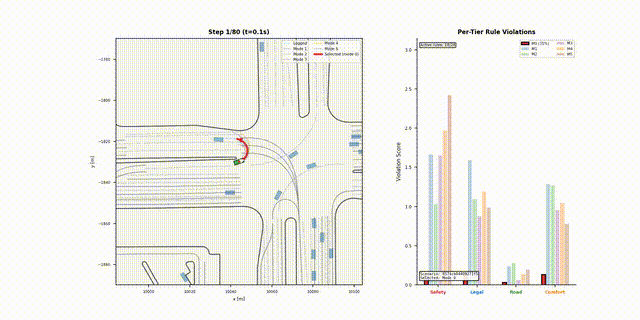
</p>
<p align="center"><em>Scenario 000 (TURN). The ego vehicle navigates through an intersection with 24 agents, 11 crosswalks, and 9 stop signs. Net heading change: 178 deg. The selector evaluates collision risk (Safety tier) and right-of-way compliance (Legal tier) at each of the 4 replanning steps.</em></p>

### Lane Change Scenario
<p align="center">
  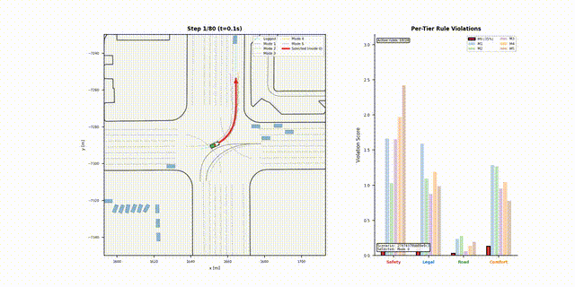
</p>
<p align="center"><em>Scenario 020 (LANE_CHANGE). 81.5m displacement over 8 seconds. Comfort-tier rules (smooth lateral acceleration, lane-change smoothness) differentiate between geometrically similar candidates. The selector prefers the kinematically smoother transition over a sharper merge.</em></p>

### Complex Multi-Phase Maneuver
<p align="center">
  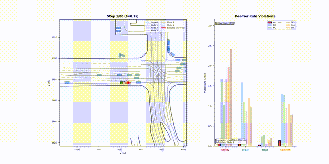
</p>
<p align="center"><em>Scenario 050 (COMPLEX). Stop-and-go behavior with 45 agents and multiple interacting vehicles. 20 lateral reversals and 2 lane transitions. The compounding effect of selection decisions is visible: choices made early in the rollout constrain the feasible set at later replanning steps.</em></p>

### Exit Ramp Scenario
<p align="center">
  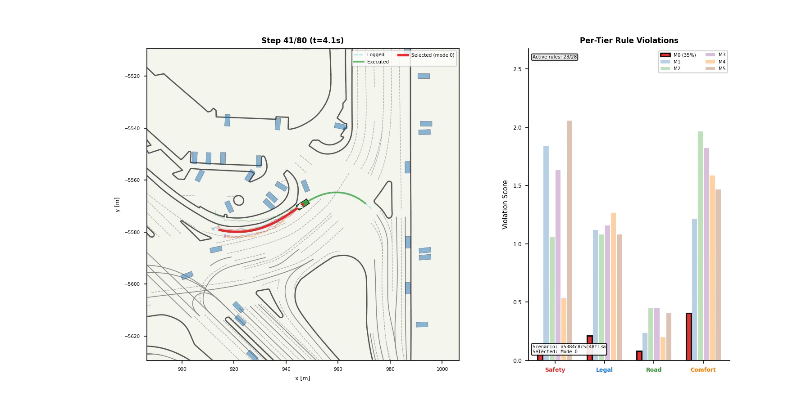
</p>
<p align="center"><em>Scenario 034 (EXIT_RAMP, step 41/80). The ego navigates a highway exit with curved road geometry and merging lanes. The violation panel shows differentiated Comfort-tier costs across modes — the selector prefers the trajectory with smoother lateral dynamics through the curve. 58.8m total displacement over 8 seconds.</em></p>

### Lane Change — Violation Panel Detail
<p align="center">
  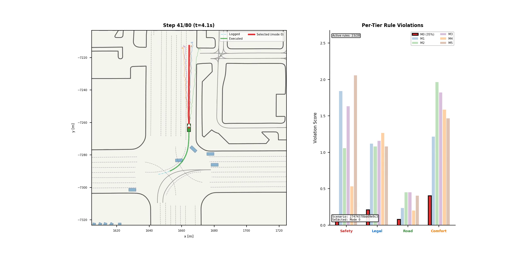
</p>
<p align="center"><em>Scenario 020 (LANE_CHANGE, step 41/80). The right panel shows per-mode violation scores across all four tiers. Mode 0 (35% confidence, dark red) has elevated Safety and Comfort costs. Mode 3 (selected) has lower aggregate cost despite lower confidence. The lexicographic selector resolves this correctly: Safety cost takes priority regardless of confidence ranking.</em></p>

### Visualization Infrastructure

The simulation visualization pipeline produces publication-quality outputs:

- **Metric distribution plots**: violin and grid plots for all 11 metrics across selectors ([`viz/metric_distributions.py`](scripts/simulation_engine/viz/metric_distributions.py))
- **Safety profile**: per-scenario horizontal bars and pie charts (collision-free / minor / significant) ([`viz/scenario_safety_profile.py`](scripts/simulation_engine/viz/scenario_safety_profile.py))
- **Summary tables**: LaTeX (`booktabs`) and Markdown with mean, std, median, Q1, Q3, min, max ([`viz/summary_table.py`](scripts/simulation_engine/viz/summary_table.py))
- **Scenario heatmaps**: scenario x metric matrix sorted by aggregate score ([`viz/scenario_heatmap.py`](scripts/simulation_engine/viz/scenario_heatmap.py))
- **BEV rollout videos**: ego (green rectangle, red on collision), agents (blue oriented rectangles), logged trajectory (dashed cyan), RECTOR trajectory (solid green), 60m view range ([`viz/bev_rollout.py`](scripts/simulation_engine/viz/bev_rollout.py))
- **Enhanced BEV**: dual-panel with trajectory candidates + per-tier violation bar chart ([`viz/enhanced_bev_rollout.py`](scripts/simulation_engine/viz/enhanced_bev_rollout.py))

All 55 closed-loop videos: [`output/closedloop/videos/`](output/closedloop/videos/). Simulation engine documentation: [`scripts/simulation_engine/README.md`](scripts/simulation_engine/README.md).

---

## Predictor-Agnostic Selection: M2I + RECTOR

A secondary contribution is demonstrating that RECTOR's rule-aware selection operates independently of the trajectory generator. The M2I+RECTOR pipeline takes pretrained M2I (DenseTNT) trajectory candidates — generated without any rule awareness — and applies RECTOR's full 28-rule evaluation and lexicographic selection as a post-hoc compliance layer. No retraining of the upstream predictor is required.

The pipeline is implemented in [`models/RECTOR/scripts/lib/rector_pipeline.py`](models/RECTOR/scripts/lib/rector_pipeline.py):

```
M2I DenseTNT (frozen)
    │
    ├─ 6 trajectory candidates [K, 80, 2] (8 seconds @ 10 Hz)
    │
    └─ RECTOR Rule Scoring
        ├─ SceneFeatureExtractor: extract agent positions, lane geometry,
        │   signal states from Waymo proto
        ├─ DifferentiableRuleProxies: per-candidate violation costs [K, 28]
        ├─ TieredRuleScorer: aggregate into tier scores [K, 4]
        └─ Lexicographic selection → compliant trajectory
```

The safety layer ([`scripts/lib/safety_layer.py`](models/RECTOR/scripts/lib/safety_layer.py)) provides additional guarantees:
- **RealityChecker**: kinematic bounds on acceleration, jerk, steering rate
- **OBBCollisionChecker**: oriented bounding box collision detection
- **DeterministicCVaRScorer**: worst-case cost estimation under uncertainty

<p align="center">
  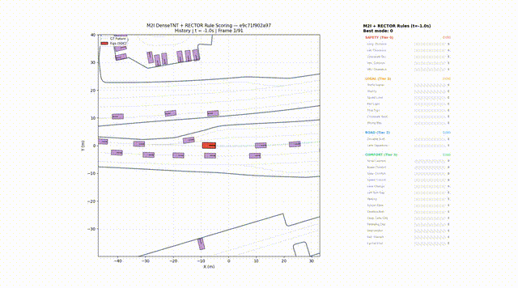
</p>
<p align="center"><em>M2I+RECTOR receding-horizon planning. Candidate trajectories are color-coded from red (high violation cost) to green (compliant). The selected trajectory (highlighted) is the lexicographic winner, not necessarily the highest-confidence mode. Replanning occurs every 2 seconds.</em></p>

### M2I Baseline Receding-Horizon Predictions

12 receding-horizon GIFs show the M2I baseline (DenseTNT) predictions **without** RECTOR's rule-aware selection — demonstrating the behavior of confidence-only mode selection over time:

<p align="center">
  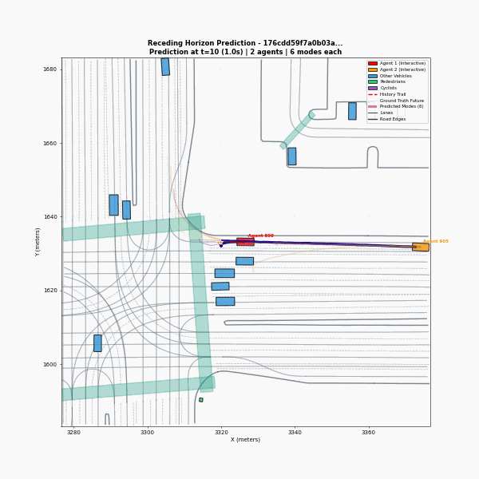
</p>
<p align="center"><em>M2I receding-horizon prediction at an intersection. 2 interactive agents, 6 predicted modes each. Lane geometry (gray), road edges, crosswalks (teal polygons), and traffic signals are rendered. Without rule scoring, mode selection relies entirely on learned confidence.</em></p>

40 M2I+RECTOR demonstration videos: [`models/RECTOR/movies/m2i_rector/`](models/RECTOR/movies/m2i_rector/). 12 M2I baseline receding-horizon GIFs: [`models/pretrained/m2i/movies/receding_horizon/`](models/pretrained/m2i/movies/receding_horizon/).

---

## Generated Artifacts

Every quantitative claim traces to machine-readable source files. The artifact generation pipeline transforms these into publication-ready outputs. Master orchestrator: [`generate_all_artifacts.py`](models/RECTOR/scripts/artifacts/generate_all_artifacts.py) — produces 48 figures (PDF + PNG) and 10 LaTeX tables.

### Evaluation Data

| File | Contents | Produced by |
|------|----------|-------------|
| [`canonical_results.json`](output/evaluation/canonical_results.json) | All paper metrics: geometric, selection strategies, protocol grid, per-rule F1 for 28 rules | `evaluate_canonical.py` |
| [`evaluation_results.json`](output/evaluation/evaluation_results.json) | Quick open-loop metrics (43,219 samples, ~98 samples/sec) | `evaluate_rector.py` |
| [`per_scenario_metrics.csv`](output/evaluation/per_scenario_metrics.csv) | Per-scenario ADE/FDE/miss for paired statistical tests | `evaluate_canonical.py` |
| [`per_scenario_confidence.csv`](output/evaluation/per_scenario_confidence.csv) | Per-scenario metrics under confidence selection | `evaluate_canonical.py` |
| [`per_scenario_weighted_sum.csv`](output/evaluation/per_scenario_weighted_sum.csv) | Per-scenario metrics under weighted-sum selection | `evaluate_canonical.py` |
| [`per_scenario_lexicographic.csv`](output/evaluation/per_scenario_lexicographic.csv) | Per-scenario metrics under lexicographic selection | `evaluate_canonical.py` |
| [`per_scenario_protB_{strategy}.csv`](output/evaluation/) | Per-scenario Protocol B metrics (full-28, oracle) per strategy | `evaluate_canonical.py` |
| [`hybrid_cross_results.json`](output/evaluation/hybrid_cross_results.json) | Cross-evaluation: hybrid conservative selection, oracle evaluation | `evaluate_canonical.py --applicability_mode hybrid_conservative` |
| [`always_on_cross_results.json`](output/evaluation/always_on_cross_results.json) | Cross-evaluation: always-on selection, oracle evaluation | `evaluate_canonical.py --applicability_mode always_on` |
| [`learned_cross_results.json`](output/evaluation/learned_cross_results.json) | Cross-evaluation: learned selection, oracle evaluation | `evaluate_canonical.py --applicability_mode learned` |
| [`val_test_distribution.json`](output/evaluation/val_test_distribution.json) | Val vs test distributional comparison with KS tests | `val_test_distribution_compare.py` |
| [`enhanced_summary.json`](output/closedloop/videos/enhanced_summary.json) | 55 closed-loop scenario results: steps, overlaps, category, infrastructure | `enhanced_bev_rollout.py` |

### Publication Figures (24 PDF/PNG pairs)

All figures are generated at 300 DPI with IEEE-compliant formatting. Source: [`models/RECTOR/output/artifacts/figures/`](models/RECTOR/output/artifacts/figures/).

| Category | Figures | Generator |
|----------|---------|-----------|
| Training convergence | [`stage1_training`](models/RECTOR/output/artifacts/figures/stage1_training.png), [`stage2_training`](models/RECTOR/output/artifacts/figures/stage2_training.png), [`training_combined`](models/RECTOR/output/artifacts/figures/training_combined.png), [`learning_rate`](models/RECTOR/output/artifacts/figures/learning_rate.png) | `generate_training_curves.py` |
| Rule compliance | [`tier_violation_comparison`](models/RECTOR/output/artifacts/figures/tier_violation_comparison.png), [`violation_reduction`](models/RECTOR/output/artifacts/figures/violation_reduction.png), [`rule_breakdown`](models/RECTOR/output/artifacts/figures/rule_breakdown.png) | `generate_rule_violation_analysis.py` |
| Applicability head | [`applicability_heatmap`](models/RECTOR/output/artifacts/figures/applicability_heatmap.png), [`applicability_tier_f1`](models/RECTOR/output/artifacts/figures/applicability_tier_f1.png) | `generate_applicability_analysis.py` |
| Ablation study | [`ablation_comparison`](models/RECTOR/output/artifacts/figures/ablation_comparison.png), [`ablation_radar`](models/RECTOR/output/artifacts/figures/ablation_radar.png), [`component_impact`](models/RECTOR/output/artifacts/figures/component_impact.png) | `generate_ablation_study.py` |
| Error distributions | [`ade_fde_distribution`](models/RECTOR/output/artifacts/figures/ade_fde_distribution.png), [`percentile_analysis`](models/RECTOR/output/artifacts/figures/percentile_analysis.png), [`miss_rate_analysis`](models/RECTOR/output/artifacts/figures/miss_rate_analysis.png), [`ade_fde_heatmap`](models/RECTOR/output/artifacts/figures/ade_fde_heatmap.png) | `generate_distribution_plots.py` |
| Efficiency | [`latency_breakdown`](models/RECTOR/output/artifacts/figures/latency_breakdown.png), [`parameter_breakdown`](models/RECTOR/output/artifacts/figures/parameter_breakdown.png), [`throughput_comparison`](models/RECTOR/output/artifacts/figures/throughput_comparison.png) | `generate_efficiency_stats.py` |
| Qualitative | [`scenario_gallery`](models/RECTOR/output/artifacts/figures/scenario_gallery.png), [`selection_comparison`](models/RECTOR/output/artifacts/figures/selection_comparison.png) | `generate_qualitative_visualizations.py` |

### LaTeX Tables (10 files)

All tables use `booktabs` style for direct `\input{}` inclusion. Source: [`models/RECTOR/output/artifacts/tables/`](models/RECTOR/output/artifacts/tables/).

| Table | File | Contents |
|-------|------|----------|
| Main results | [`main_results.tex`](models/RECTOR/output/artifacts/tables/main_results.tex) | minADE, minFDE, miss rate, violation rates |
| Detailed results | [`detailed_results.tex`](models/RECTOR/output/artifacts/tables/detailed_results.tex) | Extended comparison with per-tier breakdown |
| Tier violations | [`tier_violations.tex`](models/RECTOR/output/artifacts/tables/tier_violations.tex) | Per-tier violation rates with reduction annotations |
| Selection strategy | [`selection_strategy.tex`](models/RECTOR/output/artifacts/tables/selection_strategy.tex) | Strategy comparison with complexity analysis |
| Rule catalog | [`rule_catalog.tex`](models/RECTOR/output/artifacts/tables/rule_catalog.tex) | Complete 28-rule taxonomy |
| Ablation | [`ablation.tex`](models/RECTOR/output/artifacts/tables/ablation.tex) | Component ablation with delta annotations |
| Ablation (detailed) | [`ablation_detailed.tex`](models/RECTOR/output/artifacts/tables/ablation_detailed.tex) | Full ablation with component descriptions |
| Per-rule F1 | [`applicability_per_rule.tex`](models/RECTOR/output/artifacts/tables/applicability_per_rule.tex) | Per-rule precision, recall, F1, support |
| Efficiency | [`efficiency.tex`](models/RECTOR/output/artifacts/tables/efficiency.tex) | Parameters, latency, throughput |
| Parameters | [`param_breakdown.tex`](models/RECTOR/output/artifacts/tables/param_breakdown.tex) | Per-component parameter counts |

Artifact generation details: [`models/RECTOR/scripts/artifacts/README.md`](models/RECTOR/scripts/artifacts/README.md).

### Video Demonstrations (227+ videos and GIFs)

| Collection | Count | Location | Contents |
|-----------|-------|----------|----------|
| Closed-loop simulation | 55 | [`output/closedloop/videos/`](output/closedloop/videos/) | Dual-panel BEV: scene + rule violation bar charts. 8s rollouts, 2s replanning. 5 maneuver categories. |
| M2I+RECTOR planning | 40 | [`models/RECTOR/movies/m2i_rector/`](models/RECTOR/movies/m2i_rector/) | Rule-scored trajectory selection with color-coded candidates (red=violating, green=compliant). |
| WOMD raw scenarios | 120 | [`data/WOMD/movies/bev/`](data/WOMD/movies/bev/) | Unmodified scenario animations across 3 splits x 2 formats. |
| M2I receding-horizon | 12 GIFs | [`models/pretrained/m2i/movies/receding_horizon/`](models/pretrained/m2i/movies/receding_horizon/) | M2I predictions without rule-aware selection: full BEV with lanes, crosswalks, agents. |

### Training Logs

| Log | Stage | Location | Key Metrics |
|-----|-------|----------|-------------|
| Applicability head | Stage 1 (20 epochs) | [`output/app_head_fresh_log.txt`](output/app_head_fresh_log.txt) | Best loss: 0.2772, F1: 0.818, ~2.5h |
| Full RECTOR | Stage 2 (20 epochs) | [`output/rector_full_log.txt`](output/rector_full_log.txt) | Best loss: 2.3487, ADE: 0.88m, ~7.9h |
| Continuation | +3 epochs | [`output/rector_continue_5ep_log.txt`](output/rector_continue_5ep_log.txt) | Best ADE: 0.67m, FDE: 1.26m, ~3.3h |

---

## Reproduction

This section captures the primary research workflow. Additional workspace-level operations, validation strategy, and output governance appear after the repository-structure and documentation-index sections.

### Prerequisites

- Python 3.10+, PyTorch 2.0+, JAX 0.4+ (for Waymax)
- Waymo Open Motion Dataset v1.3.0 (`validation_interactive` split minimum)
- Pretrained M2I backbone weights in `models/pretrained/`

For a fully provisioned setup, use the development container described in [.devcontainer/README.md](.devcontainer/README.md).

### Data Preparation

```bash
cd /workspace/data/WOMD

# Step 1: Filter raw scenarios to 2-agent interactive scenarios
python scripts/lib/filter_interactive_scenario.py \
    --input-dir datasets/waymo_open_dataset/motion_v_1_3_0/raw/scenario/training \
    --output-dir datasets/waymo_open_dataset/motion_v_1_3_0/raw/scenario/training_interactive \
    --type v2v

# Step 2: Convert Scenario proto to TF Example format
python scripts/lib/scenario_to_example.py \
    --input_dir datasets/waymo_open_dataset/motion_v_1_3_0/raw/scenario/training_interactive \
    --output_dir datasets/waymo_open_dataset/motion_v_1_3_0/processed/tf/training_interactive

# Step 3: Augment with 28-rule supervision labels
python -m waymo_rule_eval.augmentation.augment_cli \
    --input datasets/waymo_open_dataset/motion_v_1_3_0/processed/tf/training_interactive \
    --output datasets/waymo_open_dataset/motion_v_1_3_0/processed/augmented/scenario/training_interactive
```

### Training

```bash
cd /workspace/models/RECTOR

# Stage 1: Pre-train applicability head (20 epochs, ~2.5h)
python scripts/training/train_applicability.py

# Stage 2: Full end-to-end training (20 epochs, ~8h)
# Option A: Pre-cache for 3-5x faster epochs (recommended)
python scripts/training/preprocess_cache.py --split train --workers 8
python scripts/training/preprocess_cache.py --split val --workers 8
python scripts/training/train_rector.py \
    --cache_dir /workspace/data/WOMD/datasets/waymo_open_dataset/motion_v_1_3_0/processed/augmented/cached

# Option B: Direct from TFRecords
python scripts/training/train_rector.py
```

### Evaluation

```bash
# Canonical evaluation (all paper metrics, ~9 minutes)
python scripts/evaluation/evaluate_canonical.py \
    --checkpoint models/best.pt --per_rule_metrics

# Bootstrap confidence intervals
python scripts/evaluation/compute_bootstrap_cis.py \
    --input /workspace/output/evaluation/canonical_results.json

# Adversarial injection
python scripts/evaluation/adversarial_injection.py \
    --checkpoint models/best.pt

# Quick open-loop evaluation
python scripts/evaluation/evaluate_rector.py \
    --checkpoint models/best.pt
```

### Artifact Generation

```bash
# All figures and tables (48 figures + 10 tables)
python scripts/artifacts/generate_all_artifacts.py

# Individual generators
python scripts/artifacts/generate_main_results_table.py
python scripts/artifacts/generate_rule_violation_analysis.py
python scripts/artifacts/generate_training_curves.py
python scripts/artifacts/generate_ablation_study.py
python scripts/artifacts/generate_applicability_analysis.py
python scripts/artifacts/generate_distribution_plots.py
python scripts/artifacts/generate_efficiency_stats.py
python scripts/artifacts/generate_qualitative_visualizations.py
```

### Closed-Loop Simulation

```bash
cd /workspace

# Quick validation (50 scenarios, ~5 minutes)
python -m simulation_engine.validate_50

# Enhanced BEV with violations panel (55 diverse scenarios, ~1 hour)
python scripts/simulation_engine/viz/enhanced_bev_rollout.py \
    --target-movies 55 --shards-to-scan 40 --scenarios-per-shard 40

# Full artifact generation (metric plots, tables, heatmaps)
python scripts/simulation_engine/viz/generate_all.py \
    --results /workspace/output/closedloop/validate_50_results.json \
    --outdir /workspace/output/closedloop/artifacts/
```

### Video Generation

```bash
cd /workspace/models/RECTOR

# M2I+RECTOR planning demonstrations (40 videos)
python scripts/visualization/generate_m2i_movies.py \
    --num_scenarios 40 --predict_interval 20 --min_ego_speed 3.0

# RECTOR receding-horizon demonstrations (20 videos)
python scripts/visualization/generate_receding_movies.py \
    --checkpoint models/best.pt --num_scenarios 20

# WOMD raw BEV movies
python data/WOMD/scripts/lib/generate_bev_movie.py \
    --format scenario --split validation_interactive --num 20
```

---

## Repository Structure

```text
/workspace
├── data/                               Data pipeline and rule evaluation
│   └── WOMD/
│       ├── datasets/                   Raw and processed Waymo TFRecord files (151 GB)
│       │   └── waymo_open_dataset/motion_v_1_3_0/
│       │       ├── raw/scenario/       Raw unfiltered TFRecords
│       │       │   ├── training_interactive/
│       │       │   ├── validation_interactive/
│       │       │   └── testing_interactive/
│       │       └── processed/
│       │           ├── tf/             Converted to TF Example format
│       │           └── augmented/      Augmented with 28-rule feature vectors
│       ├── movies/bev/                 120 bird's-eye-view scenario videos
│       │   ├── scenario/              60 videos (3 splits x 20)
│       │   └── tf/                    60 videos (3 splits x 20)
│       ├── visualizations/            90 static scenario PNG renderings
│       │   ├── scenario/              45 (15 scenarios x 3 views)
│       │   └── tf/                    45 (15 scenarios x 3 views)
│       ├── scripts/
│       │   ├── lib/
│       │   │   ├── filter_interactive_scenario.py
│       │   │   ├── scenario_to_example.py
│       │   │   ├── visualize_scenario.py
│       │   │   └── generate_bev_movie.py
│       │   └── bash/                  Shell scripts for batch processing
│       ├── src/                       Low-level format conversion utilities
│       └── waymo_rule_eval/           28-rule evaluation framework
│           ├── core/                  ScenarioContext, EgoState, MapContext, geometry
│           ├── rules/                 28 rule implementations (l0_*.py through l10_*.py)
│           │   └── rule_constants.py  Canonical 28-rule ordering (source of truth)
│           ├── pipeline/              RuleExecutor orchestration, window scheduler
│           ├── augmentation/          TFRecord augmentation with rule labels
│           │   ├── augment_cli.py     Main CLI for augmentation
│           │   └── tfrecord_augmenter.py
│           ├── data_access/           MotionScenarioReader adapter
│           ├── cli/                   Command-line interface (wrun.py)
│           ├── io/                    I/O adapters
│           ├── utils/                 Constants, logging
│           └── tests/                 Rule evaluation tests
│
├── models/
│   ├── RECTOR/                        Primary research implementation
│   │   ├── scripts/
│   │   │   ├── models/                Neural architectures
│   │   │   │   ├── m2i_encoder.py     SubGraph + GlobalGraph + LaneGCN
│   │   │   │   ├── rule_aware_generator.py   Full model composition
│   │   │   │   ├── applicability_head.py     TierAwareBlocks (4 tiers)
│   │   │   │   ├── tiered_scorer.py          Lexicographic + soft-min scorer
│   │   │   │   └── cvae_head.py              CVAE Transformer decoder (if separate)
│   │   │   ├── training/
│   │   │   │   ├── train_rector.py           Stage 2: full model (7-component loss)
│   │   │   │   ├── train_applicability.py    Stage 1: applicability head (focal BCE)
│   │   │   │   ├── losses.py                 RECTORLoss (WTA, endpoint, KL, goal, smooth, conf, app)
│   │   │   │   └── preprocess_cache.py       TFRecord → .pt caching (3-5x speedup)
│   │   │   ├── evaluation/
│   │   │   │   ├── evaluate_canonical.py     Canonical evaluation entry point for reported metrics
│   │   │   │   ├── evaluate_rector.py        Quick open-loop evaluation
│   │   │   │   ├── heuristic_applicability.py  4 applicability modes (learned/always_on/heuristic/hybrid_conservative)
│   │   │   │   ├── adversarial_injection.py  Safety-tier stress test (3 injection types)
│   │   │   │   ├── weight_grid_search.py     125-point weighted-sum Pareto frontier
│   │   │   │   └── compute_bootstrap_cis.py  10K bootstrap resamples + Wilcoxon tests
│   │   │   ├── inference/
│   │   │   │   └── pipeline.py               5-stage inference (encode→predict→generate→eval→select)
│   │   │   ├── visualization/
│   │   │   │   ├── generate_m2i_movies.py    M2I+RECTOR planning videos (40)
│   │   │   │   ├── generate_receding_movies.py  RECTOR receding-horizon videos
│   │   │   │   └── generate_movies.py        Standard prediction animations
│   │   │   ├── lib/
│   │   │   │   ├── rector_pipeline.py        M2I+RECTOR predictor-agnostic pipeline
│   │   │   │   ├── scene_feature_extractor.py  Waymo proto → scene tensors
│   │   │   │   ├── planning_loop.py          CandidateGenerator + ReactorSelector
│   │   │   │   └── safety_layer.py           RealityChecker + OBBCollision + CVaR
│   │   │   ├── proxies/                      24 differentiable rule proxies
│   │   │   ├── data/                         Dataset wrappers and label generation
│   │   │   ├── artifacts/                    Publication figure/table generators (9 scripts)
│   │   │   ├── experiments/
│   │   │   │   ├── evaluate_m2i_rector.py    M2I vs RECTOR direct comparison
│   │   │   │   ├── full_rule_evaluation.py   All 28 rules via RuleExecutor
│   │   │   │   ├── analyze_kinematics.py     Speed, accel, jerk distributions
│   │   │   │   ├── count_parameters.py       Parameter breakdown by component
│   │   │   │   └── compute_rule_metrics.py   Proxy metrics from predictions
│   │   │   └── diagnostics/
│   │   │       ├── diagnostic_compare.py     Training vs receding pipeline comparison
│   │   │       ├── diagnostic_quality.py     Trajectory smoothness inspection
│   │   │       └── diagnostic_smooth.py      Raw vs smoothed trajectory analysis
│   │   ├── checkpoints/                      Trained weights (Stage 1 + Stage 2)
│   │   ├── models/                           best.pt symlink
│   │   ├── movies/                           40 M2I+RECTOR demonstration videos
│   │   ├── output/
│   │   │   └── artifacts/
│   │   │       ├── figures/                  24 PNG + 24 PDF
│   │   │       └── tables/                   10 LaTeX tables
│   │   ├── tests/                            Integration and unit tests
│   │   └── docs/                             Design notes, sensitivity findings
│   └── pretrained/
│       └── m2i/                              M2I backbone (DenseTNT)
│           └── movies/receding_horizon/      12 baseline receding-horizon GIFs
│
├── scripts/
│   ├── simulation_engine/                    Waymax closed-loop simulation
│   │   ├── config.py                         ExperimentConfig dataclasses
│   │   ├── validate_50.py                    Quick 50-scenario validation
│   │   ├── waymax_bridge/
│   │   │   ├── scenario_loader.py            WOMD TFRecord → SimulatorState
│   │   │   ├── env_factory.py                PlanningAgentEnvironment + DeltaGlobal
│   │   │   ├── simulation_loop.py            WaymaxRECTORLoop (main orchestrator)
│   │   │   ├── observation_extractor.py      SimulatorState → RECTOR input tensors
│   │   │   ├── action_converter.py           Ego-local trajectory → DeltaGlobal action
│   │   │   └── metric_collector.py           11-metric accumulation and finalization
│   │   ├── selectors/
│   │   │   ├── base.py                       BaseSelector + DecisionTrace
│   │   │   ├── confidence.py                 argmax(confidence) baseline
│   │   │   ├── weighted_sum.py               Weighted-sum with tunable tier weights
│   │   │   └── rector_lex.py                 Lexicographic elimination (proposed)
│   │   └── viz/
│   │       ├── generate_all.py               Master visualization orchestrator
│   │       ├── metric_distributions.py       Violin + grid plots (IEEE format)
│   │       ├── summary_table.py              LaTeX/Markdown summary tables
│   │       ├── scenario_safety_profile.py    Safety bars + pie charts
│   │       ├── scenario_heatmap.py           Scenario x metric heatmap
│   │       ├── bev_rollout.py                Simple BEV videos
│   │       └── enhanced_bev_rollout.py       Dual-panel BEV + violation charts
│   ├── analysis/                              Offline analysis scripts for paper revision
│   │   └── val_test_distribution_compare.py   Val vs test KS distributional comparison
│   └── WOMD/                                 Dataset management shell scripts
│
├── output/                                   All generated outputs
│   ├── evaluation/                           canonical_results.json, cross-eval JSONs, per-scenario CSVs
│   ├── closedloop/videos/                    55 dual-panel BEV rollout videos + summary JSON
│   ├── app_head_fresh_log.txt                Stage 1 training log
│   ├── rector_full_log.txt                   Stage 2 training log
│   └── rector_continue_5ep_log.txt           Continuation training log
│
├── assets/
│   ├── gifs/                                 Embedded GIF demonstrations (4 files)
│   │   ├── closedloop_turn.gif               Scenario 000, TURN category
│   │   ├── closedloop_lane_change.gif        Scenario 020, LANE_CHANGE category
│   │   ├── closedloop_complex.gif            Scenario 050, COMPLEX category
│   │   └── m2i_rector_planning.gif           M2I+RECTOR planning demo
│   └── frames/                               Extracted video frames for README (5 files)
│       ├── closedloop_turn_frame.png         Turn scenario dual-panel (1800x900)
│       ├── closedloop_lanechange_frame.png   Lane change dual-panel
│       ├── closedloop_010_frame.png          Dense intersection (185 agents)
│       ├── closedloop_exitramp_frame.png     Exit ramp scenario
│       └── m2i_rector_000_frame.png          M2I+RECTOR rule scoring panel
│
├── experiments/                              Experimental scratch space
├── logs/                                     Training logs
├── src/                                      C++ utilities
├── notebooks/                                Exploratory analysis
└── externals/                                External dependencies
    ├── m2i/                                  M2I backbone source
    └── waymo-open-dataset/                   Waymo SDK + documentation images
```

## Workspace-Level Operations

The repository supports several important workflows beyond the core training loop.

### Dataset management

The shell scripts under [scripts/WOMD](scripts/WOMD) manage sample acquisition, inspection, and cleanup for WOMD assets.

| Script | Purpose |
|--------|---------|
| [scripts/WOMD/download_waymo_sample.sh](scripts/WOMD/download_waymo_sample.sh) | Download sample WOMD files from Google Cloud Storage |
| [scripts/WOMD/check_waymo_status.sh](scripts/WOMD/check_waymo_status.sh) | Summarize current dataset availability and size |
| [scripts/WOMD/clear_waymo_data.sh](scripts/WOMD/clear_waymo_data.sh) | Remove downloaded WOMD files |

### Closed-loop simulation and visualization

The Waymax simulation infrastructure under [scripts/simulation_engine](scripts/simulation_engine) is a workspace-level subsystem in its own right. It provides:

- WOMD-to-Waymax state loading
- selector comparisons across confidence, weighted-sum, and lexicographic strategies
- custom and built-in Waymax metrics
- static plots, tables, heatmaps, and BEV rollout videos

### Repository-maintenance automation

The git hook scripts under [scripts/](scripts/) auto-generate structural documentation such as [WORKSPACE_STRUCTURE.md](WORKSPACE_STRUCTURE.md) and [data/DATA_INVENTORY.md](data/DATA_INVENTORY.md), and can trigger BEV movie generation when the required data is present.

### Native code utilities

The repository is not purely Python. The file [src/scenario_converter.cc](src/scenario_converter.cc) represents the native-code portion of the workspace and is relevant when low-level scenario conversion or compiled utility support is needed.

---

## Documentation Index

Every directory contains a README documenting its contents, design rationale, and connections to other modules.

### Core

| Document | Scope |
|----------|-------|
| [`models/RECTOR/README.md`](models/RECTOR/README.md) | Scientific overview: methods, two tracks, results |
| [`data/WOMD/waymo_rule_eval/README.md`](data/WOMD/waymo_rule_eval/README.md) | Complete 28-rule evaluation framework |
| [`models/RECTOR/scripts/models/README.md`](models/RECTOR/scripts/models/README.md) | Architecture, tensor shapes, parameter counts |
| [`models/RECTOR/scripts/proxies/README.md`](models/RECTOR/scripts/proxies/README.md) | Differentiable proxies: per-rule mappings and coverage |
| [`models/RECTOR/scripts/training/README.md`](models/RECTOR/scripts/training/README.md) | Two-stage training, loss functions, optimizer settings |
| [`models/RECTOR/scripts/lib/README.md`](models/RECTOR/scripts/lib/README.md) | M2I+RECTOR planning pipeline and safety layer |

### Evaluation and Artifacts

| Document | Scope |
|----------|-------|
| [`models/RECTOR/scripts/evaluation/README.md`](models/RECTOR/scripts/evaluation/README.md) | 6 evaluation scripts, protocol design, data flow |
| [`models/RECTOR/scripts/experiments/README.md`](models/RECTOR/scripts/experiments/README.md) | Focused experiments: kinematics, parameters, M2I comparison |
| [`models/RECTOR/scripts/diagnostics/README.md`](models/RECTOR/scripts/diagnostics/README.md) | Trajectory quality debugging tools |
| [`models/RECTOR/scripts/artifacts/README.md`](models/RECTOR/scripts/artifacts/README.md) | 24 figures + 10 LaTeX tables: data sources and limitations |
| [`output/README.md`](output/README.md) | All generated outputs: JSONs, CSVs, logs, videos |

### Simulation and Visualization

| Document | Scope |
|----------|-------|
| [`scripts/simulation_engine/README.md`](scripts/simulation_engine/README.md) | Waymax closed-loop simulation architecture |
| [`scripts/simulation_engine/waymax_bridge/README.md`](scripts/simulation_engine/waymax_bridge/README.md) | Simulator bridge: observation extraction, action conversion |
| [`scripts/simulation_engine/selectors/README.md`](scripts/simulation_engine/selectors/README.md) | Three selection strategies with DecisionTrace audit |
| [`scripts/simulation_engine/viz/README.md`](scripts/simulation_engine/viz/README.md) | Visualization modules and metric reporting |

### Data and Checkpoints

| Document | Scope |
|----------|-------|
| [`data/README.md`](data/README.md) | Data provenance and augmentation pipeline |
| [`data/DATA_INVENTORY.md`](data/DATA_INVENTORY.md) | Complete dataset inventory (1,196 files, 151 GB) |
| [`models/RECTOR/checkpoints/README.md`](models/RECTOR/checkpoints/README.md) | Trained checkpoints with architecture summary |
| [`models/RECTOR/output/README.md`](models/RECTOR/output/README.md) | Training run history |
| [`models/RECTOR/output/artifacts/README.md`](models/RECTOR/output/artifacts/README.md) | Publication artifact inventory |
| [`models/RECTOR/movies/README.md`](models/RECTOR/movies/README.md) | 40 M2I+RECTOR planning videos |
| [`output/closedloop/videos/README.md`](output/closedloop/videos/README.md) | 55 closed-loop simulation videos |
| [`data/WOMD/movies/README.md`](data/WOMD/movies/README.md) | 120 raw WOMD scenario videos |

## Testing and Validation

The workspace uses multiple layers of validation rather than relying on a single test command.

### RECTOR project-local tests

The main project-local tests live under [models/RECTOR/tests](models/RECTOR/tests). They cover batched adapters, planning loops, safety-layer behavior, integration paths, and script syntax health.

One broad smoke test is [models/RECTOR/tests/test_scripts_syntax_health.py](models/RECTOR/tests/test_scripts_syntax_health.py), which attempts to compile all Python modules under `models/RECTOR/scripts/` as a syntax safety net.

### Rule-evaluation tests

The 28-rule framework ships with its own dedicated test suite under [data/WOMD/waymo_rule_eval/tests](data/WOMD/waymo_rule_eval/tests). Those tests are scenario-driven and validate both phases of rule handling: applicability detection and violation assessment.

### Evaluation-time validation

In this repository, reproducibility also depends on checked outputs and rerunnable pipelines:

- canonical evaluation JSONs in [output/evaluation](output/evaluation)
- per-scenario CSVs used for paired statistical analysis
- closed-loop summary JSONs and videos in [output/closedloop](output/closedloop)
- training logs and artifact-generation logs in [output/](output/)

The practical standard is therefore broader than "unit tests pass": the code should also regenerate the evidence files documented throughout the workspace.

## Outputs and Evidence

This repository carries a large amount of checked-in derived evidence alongside source code. Those outputs are important because they show what has already been run and which scripts produced the published or draft-reported results.

The most important output roots are:

| Path | Contents |
|------|----------|
| [output/evaluation](output/evaluation) | canonical results, cross-evaluation JSONs, per-scenario CSVs |
| [output/closedloop](output/closedloop) | closed-loop rollout videos and summaries |
| [models/RECTOR/output/artifacts](models/RECTOR/output/artifacts) | publication-grade figures and LaTeX tables |
| [models/RECTOR/movies](models/RECTOR/movies) | M2I+RECTOR demonstration videos |
| [data/WOMD/movies](data/WOMD/movies) | raw scenario BEV videos |

For the authoritative output inventory, see [output/README.md](output/README.md).

## Paper and Presentation Workspace

The repository also includes manuscript and presentation materials under [reference/IEEE_T-IV_2026](reference/IEEE_T-IV_2026). These files are useful for understanding how the codebase maps into the paper, but they are not the execution source of truth. For technical truth, prefer the code, generated outputs, and subsystem READMEs.

## How To Use This README

This document is intentionally broad. Use it in one of three ways:

1. **As a repository map** to understand where each subsystem lives.
2. **As a workflow guide** to reproduce training, evaluation, simulation, and artifacts.
3. **As a documentation index** to jump into the subsystem README that answers a specific question.

If a detail here diverges from the code or a more specialized subsystem document, treat the code as the source of truth and update the documentation accordingly.

---

## License

Apache License 2.0. See [LICENSE](LICENSE).
